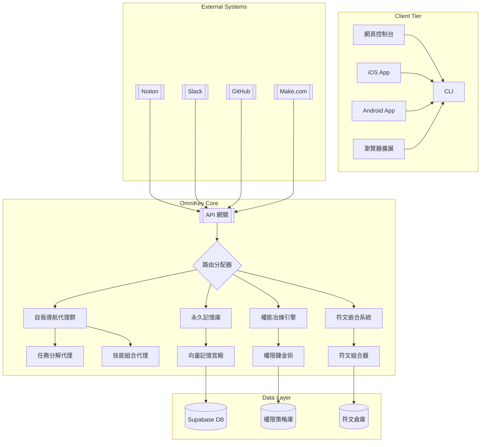

# Jun.Ai.Key 萬能元鑰總系統

> 在知識的聖殿中，自我導航的智能體冶煉權能、嵌合符文，於記憶長廊中光速前行。

---

## 目錄

- [專案願景與定位](#專案願景與定位)
- [專案結構](#專案結構)
- [架構全景圖](#架構全景圖)
- [快速開始](#快速開始)
- [CI/CD 自動化](#cicd-自動化)
- [核心模組範例](#核心模組範例)
- [商業化路徑](#商業化路徑)
- [驗證指標](#驗證指標)
- [版本資訊](#版本資訊)

---

## 專案願景與定位

- 以用戶為中心，打造可自我進化、知識永續、社群共創的 AI 智能代理平台。
- 四大核心支柱（自我導航、永久記憶、權能冶煉、符文嵌合）組成進化飛輪，驅動個人與集體智能持續進化。
- 多平台 API 整合、代理協作、同步、自動化，支援 CLI、Web、App、Webhook。
- 不只是工具，而是數位生活的「萬能元鑰」與個人/團隊的數位分身。

---

## 專案結構

```text
jun-ai-key/
├── .github/workflows/ci.yml, deploy.yml
├── docs/SPEC.md, API_LIBRARY.md
├── public/index.html
├── src/
│   ├── api/straicoApi.ts, boostApi.ts, capacitiesApi.ts
│   ├── components/, hooks/, models/, scriptApp/, styles/
│   ├── App.tsx, index.tsx
├── supabase/migrations/, functions/
├── .env.example
├── README.md
├── package.json
├── tsconfig.json
└── SPEC.md
```

---

## 架構全景圖



---

## 快速開始

1. 安裝 Node.js、npm、Supabase CLI
2. 複製 `.env.example` 為 `.env` 並填入金鑰
3. 安裝依賴並啟動：

    ```bash
    git clone https://github.com/<帳號>/jun-ai-key.git
    cd jun-ai-key
    npm install
    npm start
    ```

4. Edge Functions 偵錯：

    ```bash
    cd supabase/functions
    supabase functions serve
    ```

---

## CI/CD 自動化

- `.github/workflows/ci.yml`：自動 lint、build、test
- `.github/workflows/deploy.yml`：main 分支自動部署 GitHub Pages & Supabase Edge Functions

---

## 核心模組範例

### 自我導航代理群

```typescript
class NavigationAgent {
  constructor(private memory: MemoryPalace) {}
  async executeTask(task: Task): Promise<Result> {
    const context = await this.memory.retrieveContext(task.userId);
    const plan = await this.createPlan(task, context);
    for (const step of plan.steps) {
      const agent = AgentFactory.getAgent(step.skillType);
      const result = await agent.execute(step.parameters);
      await this.memory.storeExecution(step, result);
    }
    return plan.compileFinalResult();
  }
  private async createPlan(task: Task, context: Context): Promise<Plan> {
    const llmResponse = await LLMClient.generatePlan({
      task: task.description,
      context: context.snippets,
      availableSkills: this.getAvailableSkills()
    });
    return PlanParser.parse(llmResponse);
  }
}
```

### 永久記憶庫

```typescript
class MemoryPalace {
  constructor(private vectorDB: VectorDatabase) {}
  async retrieveContext(userId: string): Promise<Context> {
    const embeddings = await EmbeddingService.generate(task.keywords);
    const memories = await this.vectorDB.query({ userId, vectors: embeddings, topK: 5 });
    return { userId, snippets: memories.map(m => m.content) };
  }
  async storeExecution(step: PlanStep, result: any): Promise<void> {
    const memoryRecord = {
      type: 'execution',
      content: `Executed ${step.skillType} with params: ${JSON.stringify(step.parameters)}`,
      result: JSON.stringify(result),
      timestamp: new Date().toISOString()
    };
    await this.vectorDB.insert(memoryRecord);
  }
}
```

### API 網關

```typescript
import express from 'express';
const app = express();
app.use(express.json());
app.post('/v1/execute', async (req, res) => {
  const { userId, task, platform } = req.body;
  try {
    const agent = new NavigationAgent(memoryPalace);
    const result = await agent.executeTask({ userId, description: task });
    const formatter = OutputFormatterFactory.getFormatter(platform);
    res.json(formatter.format(result));
  } catch (error) {
    res.status(500).json({ error: error.message });
  }
});
app.listen(3000, () => {
  console.log('OmniKey Gateway running on port 3000');
});
```

---

## 商業化路徑

- 開源核心、插件市集、API 訂閱、企業專案、數據洞察
- 收入來源：訂閱制、API 計價、插件分潤、企業專案

---

## 驗證指標

| 指標類別 | 目標值 | 測量方法 |
|----------|--------|----------|
| API 響應時間 | < 300ms | 分佈式監控 |
| 腳本同步成功率 | > 99.95% | 端到端測試 |
| 代理協作效率 | < 5秒/任務鏈 | 任務追蹤 |
| 記憶檢索準確率 | > 92% | 向量基準測試 |

> **永續發展宣言**  
> 本系統遵循「開源核心+商業擴展」模式，確保：  
> - 核心功能永久免費開源  
> - 企業級功能訂閱制  
> - 開發者收益分成機制

---

## 版本資訊

**版本**: 1.0.0-mvp  
**更新日期**: 2025-06-25  
© 2025 Jun.AI.Key Collective. 知識聖殿永不關閉。
