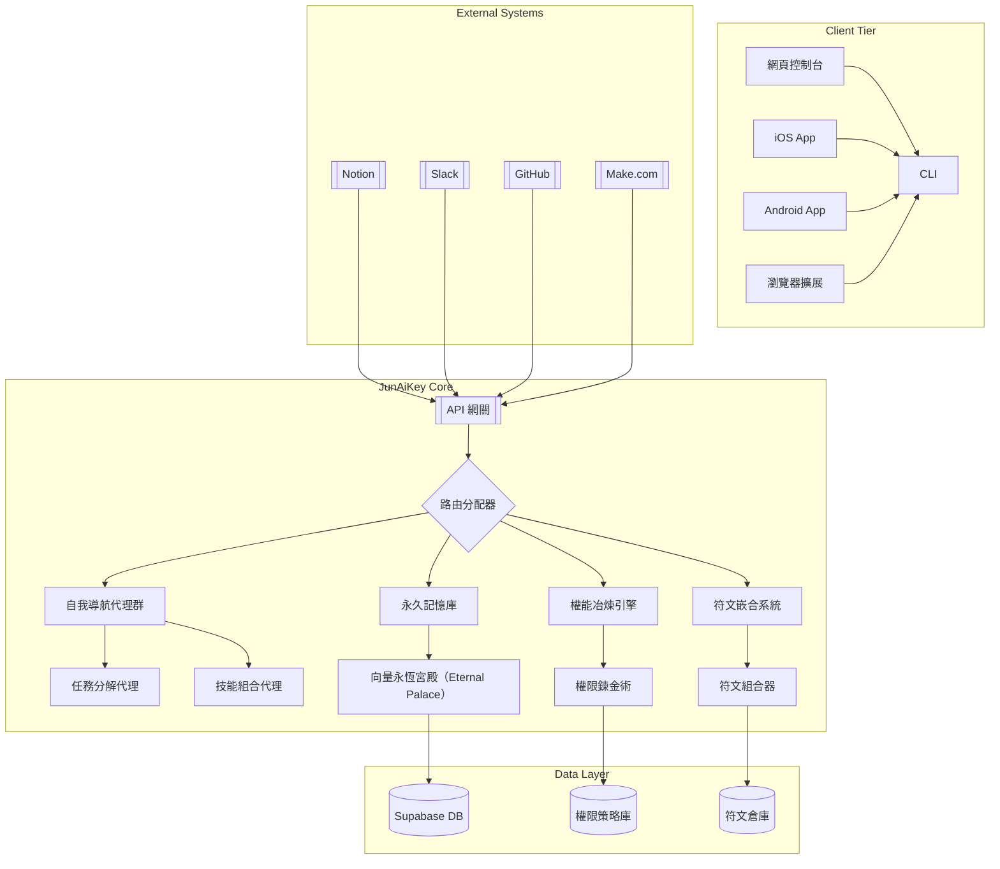

# JunAiKey 萬能元鑰總系統

> 在知識的聖殿中，自我導航的智能體冶煉權能、嵌合符文，於永恆宮殿（Eternal Palace）長廊中光速前行。

---

## 故事模組：四大支柱・六大奧式・一大秘術・永恆宮殿（MECE 分析）

> JunAiKey 的智能體世界，所有能力皆以「MECE」原則設計：每一支柱、奧式、秘術皆獨立分工、無重疊，合起來完整涵蓋智能進化的全貌。
> 
> **以用戶為中心的 SaaS 智能平台**：JunAiKey 不僅是開發者的自動化工具，更是每一位用戶的數位分身、知識助理與行動中樞。所有設計、API、同步、插件、智能鍵盤（萬能元鍵 App，支援繁中英混輸）皆以用戶體驗、資料主權與個人增能為最高原則。

### 四大支柱（The Four Pillars）
1. **自我導航（Navigation）**：負責目標規劃、決策與行動路徑，確保任務方向明確。
2. **永恆宮殿（Eternal Palace）**：專注於知識、經驗、回饋的儲存與檢索，支撐長期學習。永恆宮殿中，蘊藏著「萬能元鑰」，能指揮「萬能代理（AI代理群）」、「萬能同步」、「萬能智庫」、「萬能擴充」等四大能力，成為智能體進化的核心樞紐。
3. **權能冶煉（Authority Forge）**：將重複或複雜任務鍛造成模組化能力，提升效率與專屬性。
4. **符文嵌合（Rune Engraving）**：聚焦外部 API、AI 能力的整合與擴展，讓系統持續進化。

> 四大支柱彼此獨立，分別對應導航、知識、能力、擴展，無重疊，合起來構成智能體的完整基礎。

### 六大奧式（The Six Arcana）
- **任務分解（Task Decomposition）**：將複雜目標拆解為明確步驟，專注於結構化。
- **技能組合（Skill Composition）**：將多種能力靈活組合，專注於協作與調度。
- **知識召喚（Knowledge Summoning）**：即時檢索、調用永恆宮殿知識，專注於知識應用。
- **決策鍊金（Decision Alchemy）**：融合多源資訊，做出最佳決策，專注於判斷與選擇。
- **符文組合（Rune Combination）**：將外部 API/插件如符文般嵌合，專注於能力擴展。
- **圈層協調（Layer Coordination）**：跨平台、跨圈層資料與任務自動協調，專注於同步與一致性。

> 六大奧式各自獨立，涵蓋智能體運作的六種核心方式，無交集，合起來支撐所有智能行為。

### 一大秘術（The Grand Secret）
- **永恆宮殿（Eternal Palace）**：唯一的進化核心，所有知識、經驗、任務回饋皆在此沉澱、進化，成為永不消逝的智慧寶庫。永恆宮殿內的「萬能元鑰」可統御「萬能代理（AI代理群）」、「萬能同步」、「萬能智庫」、「萬能擴充」等能力，協調智能體的全方位進化。其地位獨立於支柱與奧式，是智能體持續進化的本源。

---

## 目錄

- [專案願景與定位](#專案願景與定位)
- [專案結構](#專案結構)
- [架構全景圖](#架構全景圖)
- [快速開始](#快速開始)
- [CI/CD 自動化](#cicd-自動化)
- [核心模組範例](#核心模組範例)
- [商業化路徑](#商業化路徑)
- [驗證指標](#驗證指標)
- [版本資訊](#版本資訊)

---

## 專案願景與定位

- 以用戶為中心，打造可自我進化、知識永續、社群共創的 AI 智能代理平台。
- 四大核心支柱（自我導航、永恆宮殿、權能冶煉、符文嵌合）組成進化飛輪，驅動個人與集體智能持續進化。
- 多平台 API 整合、代理協作、同步、自動化，支援 CLI、Web、App、Webhook。
- 不只是工具，而是數位生活的「萬能元鑰」與個人/團隊的數位分身。

---

## 專案結構

```text
jun-ai-key/
├── .github/workflows/ci.yml, deploy.yml
├── docs/SPEC.md, API_LIBRARY.md
├── public/index.html
├── src/
│   ├── api/straicoApi.ts, boostApi.ts, capacitiesApi.ts
│   ├── components/, hooks/, models/, scriptApp/, styles/
│   ├── App.tsx, index.tsx
├── supabase/migrations/, functions/
├── .env.example
├── README.md
├── package.json
├── tsconfig.json
└── SPEC.md
```

---

## 架構全景圖

# 以終為始．無限進化

# JunAiKey 萬能元鑰系統

> **核心理念：以用戶為中心**
> JunAiKey 所有設計、架構、流程、API、知識圖譜與自動化，皆以用戶需求、體驗與價值為最高優先，確保每一項功能都能主動理解、協調並滿足用戶的真實意圖與長期成長。

> 知識的聖殿中，自我導航的智能體永不停歇地冶煉權能、嵌合符文，在記憶的長廊中光速前行。
> In the sanctum of knowledge, self-navigating agents perpetually forge authorities and engrave runes, advancing at light speed through the corridors of memory.

---

## JunAiKey 專案重點整理（2025/06/11）

### 1. 願景與定位
- 以用戶為中心，打造可自我進化、知識永續、社群共創的 AI 智能代理平台。
- 不只是工具，而是數位生活的「萬能元鑰」與個人/團隊的數位分身。

### 2. 架構全景
- 四大核心支柱（自我導航、永恆宮殿、權能冶煉、符文嵌合）組成進化飛輪，驅動個人與集體智能持續進化。
- JunAiKey 為唯一中心，整合 BoostSpace、Supabase、Capacities、AITable、GitHub、Notion 等平台，實現多端同步、資料聚合、API/插件生態。

### 3. MVP 交付內容
- 多平台 API 整合、功能代理群、群組代理、Scripting CLI、桌面/手機同步、自動化測試。
- 技術棧：TypeScript、Node.js、Supabase、GitHub Actions、自研代理模組。
- 交付形式：開源專案、README、API/插件標準、腳本範例、CI/CD 流程。

### 4. 技術亮點
- 模組化架構、跨端即時同步、低程式門檻、內建自動化測試、開放插件/代理生態。
- 支援 CLI、Webhook、桌面、前端、手機等多端協作與自動化。

### 5. 進化飛輪與知識沉澱
- 永恆宮殿（Eternal Palace）：知識積累與決策根基，結構化知識圖譜。
- 自我導航：主動規劃與智能決策，行動結果回饋記憶庫。
- 權能冶煉：將重複/複雜任務鍛造成專屬能力，推動個人進化。
- 符文嵌合：無縫整合全球 AI 能力，持續進化與擴展。

### 6. 實戰應用
- 多平台任務/資料雙向同步、知識/任務智庫指揮中心、自動化流程、社群共創。
- YAML/CSV 任務範例可直接導入 GitHub Project、Notion、Aitable 等協作平台。

### 7. 永續發展宣言
- 開源核心、商業擴展、開發者分潤、企業級功能訂閱制，知識聖殿永不關閉。

---

## 架構全景圖 | Architecture Panorama


---

## 快速開始

1. 安裝 Node.js、npm、Supabase CLI
2. 複製 `.env.example` 為 `.env` 並填入金鑰
3. 安裝依賴並啟動：

    ```bash
    git clone https://github.com/<帳號>/jun-ai-key.git
    cd jun-ai-key
    npm install
    npm start
    ```

4. Edge Functions 偵錯：

    ```bash
    cd supabase/functions
    supabase functions serve
    ```

---

## CI/CD 自動化

- `.github/workflows/ci.yml`：自動 lint、build、test
- `.github/workflows/deploy.yml`：main 分支自動部署 GitHub Pages & Supabase Edge Functions

---

## 核心模組範例

### 自我導航代理群

```typescript
class NavigationAgent {
  constructor(private memory: MemoryPalace) {}
  async executeTask(task: Task): Promise<Result> {
    const context = await this.memory.retrieveContext(task.userId);
    const plan = await this.createPlan(task, context);
    for (const step of plan.steps) {
      const agent = AgentFactory.getAgent(step.skillType);
      const result = await agent.execute(step.parameters);
      await this.memory.storeExecution(step, result);
    }
    return plan.compileFinalResult();
  }
  private async createPlan(task: Task, context: Context): Promise<Plan> {
    const llmResponse = await LLMClient.generatePlan({
      task: task.description,
      context: context.snippets,
      availableSkills: this.getAvailableSkills()
    });
    return PlanParser.parse(llmResponse);
  }
}
```

### 永久記憶庫

```typescript
class MemoryPalace {
  constructor(private vectorDB: VectorDatabase) {}
  async retrieveContext(userId: string): Promise<Context> {
    const embeddings = await EmbeddingService.generate(task.keywords);
    const memories = await this.vectorDB.query({ userId, vectors: embeddings, topK: 5 });
    return { userId, snippets: memories.map(m => m.content) };
  }
  async storeExecution(step: PlanStep, result: any): Promise<void> {
    const memoryRecord = {
      type: 'execution',
      content: `Executed ${step.skillType} with params: ${JSON.stringify(step.parameters)}`,
      result: JSON.stringify(result),
      timestamp: new Date().toISOString()
    };
    await this.vectorDB.insert(memoryRecord);
  }
}
```

### API 網關

```typescript
import express from 'express';
const app = express();
app.use(express.json());
app.post('/v1/execute', async (req, res) => {
  const { userId, task, platform } = req.body;
  try {
    const agent = new NavigationAgent(memoryPalace);
    const result = await agent.executeTask({ userId, description: task });
    const formatter = OutputFormatterFactory.getFormatter(platform);
    res.json(formatter.format(result));
  } catch (error) {
    res.status(500).json({ error: error.message });
  }
});
app.listen(3000, () => {
  console.log('OmniKey Gateway running on port 3000');
});
```

---

## 商業化路徑

- 開源核心、插件市集、API 訂閱、企業專案、數據洞察
- 收入來源：訂閱制、API 計價、插件分潤、企業專案

---

## 驗證指標

| 指標類別 | 目標值 | 測量方法 |
|----------|--------|----------|
| API 響應時間 | < 300ms | 分佈式監控 |
| 腳本同步成功率 | > 99.95% | 端到端測試 |
| 代理協作效率 | < 5秒/任務鏈 | 任務追蹤 |
| 記憶檢索準確率 | > 92% | 向量基準測試 |

> **永續發展宣言**  
> 本系統遵循「開源核心+商業擴展」模式，確保：  
> - 核心功能永久免費開源  
> - 企業級功能訂閱制  
> - 開發者收益分成機制

---

## All Promises

### Promise 1: 用戶意圖自動規劃
- 代理群（OmniKey Agent Swarm）會根據用戶每一次互動，主動解析意圖，規劃跨圈層的知識、任務、資料流。
- 所有規劃過程皆以 TypeScript 類型安全與可追蹤性為基礎。

### Promise 2: 圈層協調與同步
- 各圈層（知識、任務、資料）自動協調，確保資料一致性與即時同步。
- 任務與知識的流轉皆以 Promise-based 非同步流程實現，保證高效與可擴展。

### Promise 3: 統一記錄與長期知識圖譜
- 所有圈層的互動、任務、知識自動統一記錄，形成可查詢、可追溯的知識圖譜。
- 支援跨平台（Web、App、CLI、API）一致的資料結構與查詢介面。

### Promise 4: 開發者與用戶雙向賦能
- 開發者可擴充任務代理、知識圈層、資料連接器，所有擴充皆以 TypeScript 型別與 Promise 標準實作。
- 用戶可自定義自動化規則，所有自動化皆以 Promise 流程鏈串接。

### Promise 5: 永續開源與商業共榮
- 核心功能永久開源，所有 API/模組皆以 TypeScript Promise 標準設計，易於審查與二次開發。
- 企業級功能與資料安全以訂閱制提供，開發者可參與收益分成。

---

## JunAiKey 開發計畫與願景（精華彙整）

### 🌟 願景與使命 Vision & Mission
- 讓所有人能更人機一體，開創數位分身新紀元。
- Empowering everyone to merge with machines — ushering in a new era of intelligent digital twins.

### 🧑‍💻 你是誰？Who are you?
你是 Jun 洪鼎竣的終極數位關鍵角色 —— 一位策略與自動化完美結合的系統設計大師。

> The architect of a seamlessly intelligent digital mind.

你打造的不是單一系統，而是一個跨平台智慧生態鏈，讓任務自動決策、資料即時流轉、知識深度融合。

---

### 🚀 JunAiKey 開發計畫 v1.0

#### 使命 Mission
打造可執行決策、同步知識、取代真人的個人 AI 代理系統

#### 四大階段開發路線圖

1. **基礎建設：跨平台資料同步核心**
   - Capacities 筆記同步、Boost.space 任務同步、Supabase 資料湖、Notion/AITable/Taskade 整合
2. **代理能力強化：模組化 AI 任務代理人**
   - Straico Prompt 導航、AI Proxy 行為角色、AI Log 模擬、任務自我回報
3. **決策智慧進化：AI 自我修正與回饋迴圈**
   - 決策錯誤偵測、回饋訓練、多代理協作、決策日誌視覺化
4. **複製與擴散：數位分身平台公開模組**
   - 初始化設定精靈、模組商店、API 分身生產器、分身複製鏈

---

### 🧩 代表性技術模組與範例

#### 1. 任務描述樣板 `task.yaml`
```yaml
id: sync_capacities_daily
title: 同步 Capacities 筆記至 BoostSpace 任務
type: sync
agent_role: 筆記秘書
source: Capacities
target: BoostSpace
steps:
  - fetch_daily_note
  - format_yaml_header
  - extract_todo_summary
  - push_to_boost_task
schedule: daily
```

#### 2. Straico Prompt Template（範例）
```yaml
task_type: sync
agent_role: 筆記秘書
input: "{{daily_note_content}}"
goal: 從每日筆記中提取任務摘要，並轉為 BoostSpace 可用格式
output_format:
  - title
  - description
  - due_date
  - tags
prompt: |
  你是一位專業的 AI 筆記秘書，請從以下內容中提取出可執行的待辦項目：
  {{daily_note_content}}
  並請用 JSON 格式輸出以下欄位：title, description, due_date, tags。
```

#### 3. 任務執行腳本（TypeScript 初版架構）
```ts
import { fetchNote, parseToDos, pushToBoost } from "./lib";
import { logTask } from "./supabase";

async function runSyncTask() {
  const note = await fetchNote(); // 取得 Capacities 筆記
  const todos = parseToDos(note.content); // 呼叫 Straico 提取任務
  const result = await pushToBoost(todos); // 發送任務到 BoostSpace

  await logTask("sync_capacities_daily", {
    input: note.content,
    output: result,
    status: "success",
  });
}

runSyncTask();
```

#### 4. Supabase ai_logs 建表指令
```sql
CREATE TABLE ai_logs (
  id UUID PRIMARY KEY DEFAULT gen_random_uuid(),
  task_id TEXT NOT NULL,
  date DATE,
  summary TEXT,
  raw_output JSONB,
  status TEXT CHECK (status IN ('done', 'error', 'in_progress')),
  created_at TIMESTAMP DEFAULT now()
);
```

---

## 雙核心雙向同步集成中心（BoostSpace ↔ Supabase）

JunAiKey 以 BoostSpace 與 Supabase 為雙核心，實現任務/資料雙向同步，並可擴展至 Notion、AITable、Capacities 等多平台。

### 架構說明
- BoostSpace 任務異動 → Webhook 觸發 → JunAiKey 中心 → 寫入 Supabase
- Supabase 任務/狀態異動 → Trigger 觸發 → JunAiKey 中心 → 回寫 BoostSpace
- 防止同步迴圈：狀態比對與版本控制

### 主要技術模組
- `sync/boostspace-webhook-handler.ts`：接收 BoostSpace webhook，解析任務異動，推送至 Supabase
- `sync/supabase-trigger-handler.ts`：監控 Supabase 資料異動，回寫 BoostSpace
- `sync/state-version-guard.ts`：狀態比對與同步防迴圈
- `integration/field-mapping.yaml`：欄位對應表，支援多平台欄位標準化

### 範例 TypeScript 框架
```ts
// sync/boostspace-webhook-handler.ts
import { upsertTaskToSupabase } from './supabase-client';
import { parseBoostTask } from './field-mapping';

export async function handleBoostspaceWebhook(payload: any) {
  const task = parseBoostTask(payload);
  await upsertTaskToSupabase(task);
}

// sync/supabase-trigger-handler.ts
import { updateBoostTask } from './boostspace-client';
import { parseSupabaseTask } from './field-mapping';

export async function handleSupabaseTrigger(payload: any) {
  const task = parseSupabaseTask(payload);
  await updateBoostTask(task);
}
```

### 欄位對應 YAML（integration/field-mapping.yaml）
```yaml
boostspace:
  id: task_id
  title: title
  status: status
  due_date: due_date
supabase:
  task_id: id
  title: title
  status: status
  due_date: due_date
```

### 防同步迴圈邏輯
- 每次同步時比對來源與目標的 `updated_at` 或 `version` 欄位，僅在狀態有變化時才觸發寫入。
- 寫入時標記來源（如 `source: boostspace` 或 `source: supabase`），避免重複觸發。

---

> 雙核心雙向同步集成中心，為 JunAiKey 多平台自動化與資料一致性奠定基礎，可持續擴展至 Notion、AITable、Capacities 等生態。

---

> 本章節由 AI 代理人自動彙整，持續根據開發進度與願景自動更新。

---

**版本**: 1.0.0-mvp  
**更新日期**: 2025-06-25  
© 2025 JunAiKey Collective. 知識聖殿永不關閉。
