# junai-key-universal-system

> in the sanctum of knowledge, self-navigating agents perpetually forge authorities and engrave runes, advancing at light speed through the corridors of memory.

---

## file-index

- [readme.md](./README.md): main narrative, architecture, story modules, technical layers
- [docs/prd.md](./docs/PRD.md): product requirements
- [docs/spec.md](./docs/SPEC.md): product specification
- [docs/api_library.md](./docs/API_LIBRARY.md): api documentation
- [docs/api_library.yaml](./docs/API_LIBRARY.yaml): api spec yaml
- [docs/contributing.md](./docs/CONTRIBUTING.md): contributing guide
- [docs/faq.md](./docs/FAQ.md): faq
- [images/junaikey-infinity-loop.svg](./images/junaikey-infinity-loop.svg): main visual

> if missing, please create a blank template. if orphaned files exist, please remove them.

---

## mece-analysis


> all capabilities in junai-key are designed with the mece principle: each pillar, arcana, and secret is independent and non-overlapping, together covering the full spectrum of intelligent evolution.
>
> **user-centric saas ai platform**: junai-key is not just a developer automation tool, but a digital twin, knowledge assistant, and action hub for every user. all design, api, sync, plugins, and the universal key app (supporting zh/en input) are built for user experience, data sovereignty, and personal empowerment.

### the-four-pillars

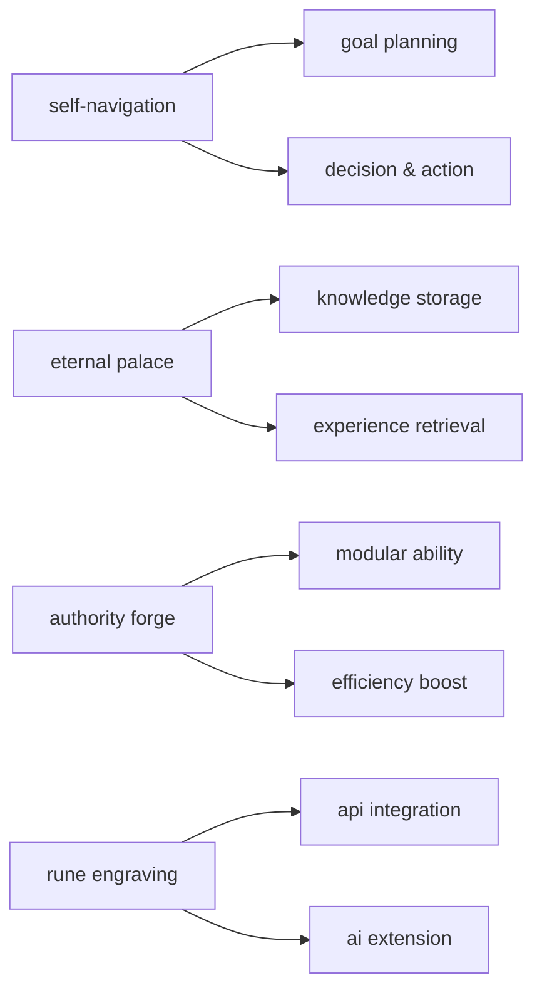

1. **self-navigation**: goal planning, decision and action path, ensuring clear task direction.
2. **eternal palace**: knowledge, experience, and feedback storage and retrieval, supporting long-term learning.
3. **authority forge**: modularizing repetitive or complex tasks for efficiency and customization.
4. **rune engraving**: integrating external api and ai capabilities for continuous evolution.

---

### the-six-arcana

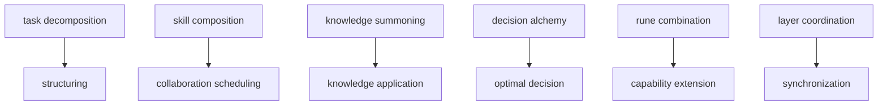

- **task decomposition**: breaking down complex goals into clear steps, focusing on structure.
- **skill composition**: flexibly combining multiple abilities, focusing on collaboration and scheduling.
- **knowledge summoning**: instant retrieval and application of knowledge from the eternal palace.
- **decision alchemy**: fusing multi-source information for optimal decisions.
- **rune combination**: integrating external api/plugins as runes for capability extension.
- **layer coordination**: automatic cross-platform, cross-layer data and task coordination for consistency.

---

### the-grand-secret

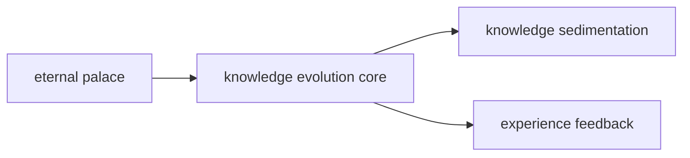

- **eternal palace**: the sole evolution core, where all knowledge, experience, and task feedback are sedimented and evolved into an everlasting wisdom repository.

---

## toc

- [project-vision-and-positioning](#project-vision-and-positioning)
- [project-structure](#project-structure)
- [architecture-panorama](#architecture-panorama)
- [quick-start](#quick-start)
- [ci-cd-automation](#ci-cd-automation)
- [core-module-examples](#core-module-examples)
- [commercialization-path](#commercialization-path)
- [verification-metrics](#verification-metrics)
- [all-promises](#all-promises)
- [junai-key-development-plan-and-vision](#junai-key-development-plan-and-vision)
- [bi-core-bidirectional-sync-center-boostspace-supabase](#bi-core-bidirectional-sync-center-boostspace-supabase)

---

## project-vision-and-positioning


- user-centric, building a self-evolving, knowledge-sustaining, community-collaborating ai intelligent agent platform.
- four core pillars (self-navigation, eternal palace, authority forge, rune engraving) form the evolution flywheel, driving continuous evolution of individual and collective intelligence.
- multi-platform api integration, agent collaboration, sync, automation, supporting cli, web, app, webhook.
- not just a tool, but a digital life's "universal key" and a personal/team digital twin.

---

## project-structure


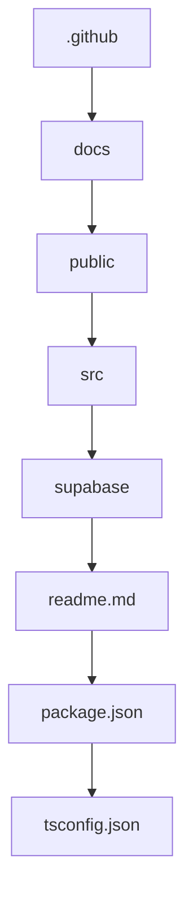

````text
jun-ai-key/
├── .github/workflows/ci.yml, deploy.yml
├── docs/SPEC.md, API_LIBRARY.md
├── public/index.html
├── src/
│   ├── api/straicoApi.ts, boostApi.ts, capacitiesApi.ts
│   ├── components/, hooks/, models/, scriptApp/, styles/
│   ├── App.tsx, index.tsx
├── supabase/migrations/, functions/
├── .env.example
├── README.md
├── package.json
├── tsconfig.json
└── SPEC.md
````

---

## architecture-panorama


> **core concept: user-centric**
> all designs, architectures, processes, apis, knowledge graphs, and automations in junai-key are prioritized to meet user needs, ensuring every function proactively understands, coordinates, and fulfills the user's true intentions and long-term growth.

> in the sanctum of knowledge, self-navigating agents perpetually forge authorities and engrave runes, advancing at light speed through the corridors of memory.

---

## junai-key-project-highlights (2025/06/11)

### 1. vision-and-positioning

- user-centric, building a self-evolving, knowledge-sustaining, community-collaborating ai intelligent agent platform.
- not just a tool, but a digital life's "universal key" and a personal/team digital twin.

### 2. architecture-overview

- four core pillars (self-navigation, eternal palace, authority forge, rune engraving) form the evolution flywheel, driving continuous evolution of individual and collective intelligence.
- junai-key as the sole hub, integrating boostspace, supabase, capacities, aitables, github, notion, etc., achieving multi-end sync, data aggregation, api/plugin ecosystem.

### 3. mvp-deliverables

- multi-platform api integration, function agent groups, group agents, scripting cli, desktop/mobile sync, automated testing.
- tech stack: typescript, node.js, supabase, github actions, self-developed agent modules.
- delivery format: open-source project, readme, api/plugin standards, script examples, ci/cd processes.

### 4. tech-highlights

- modular architecture, cross-end real-time sync, low code threshold, built-in automated testing, open plugin/agent ecosystem.
- supports cli, webhook, desktop, frontend, mobile, and other multi-end collaboration and automation.

### 5. evolution-flywheel-and-knowledge-sedimentation

- eternal palace: knowledge accumulation and decision-making foundation, structured knowledge graph.
- self-navigation: proactive planning and intelligent decision-making, action results feedback to memory.
- authority forge: modularizing repetitive/complex tasks into dedicated abilities, driving personal evolution.
- rune engraving: seamless integration of global ai capabilities, continuous evolution and expansion.

### 6. practical-applications

- multi-platform task/data bi-directional sync, knowledge/task intelligence command center, automated processes, community co-creation.
- yaml/csv task examples can be directly imported into github project, notion, aitables, and other collaboration platforms.

### 7. sustainable-development-declaration

- open-source core, commercial expansion, developer revenue sharing, enterprise-level feature subscription, the sanctum of knowledge never closes.

---

## architecture-panorama | architecture panorama


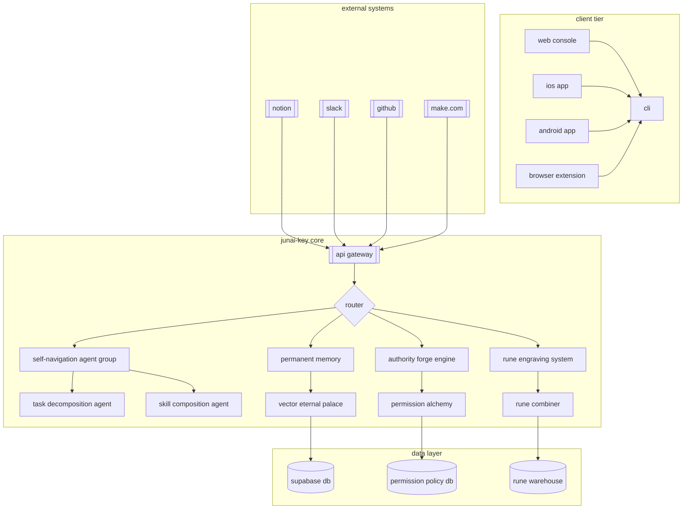

---

## quick-start

1. install node.js, npm, supabase cli

2. copy `.env.example` to `.env` and fill in the keys

3. install dependencies and start:

    ```bash
    git clone https://github.com/<account>/jun-ai-key.git
    cd jun-ai-key
    npm install
    npm start
    ```

4. edge functions debugging:

    ```bash
    cd supabase/functions
    supabase functions serve
    ```

---

## ci-cd-automation

- `.github/workflows/ci.yml`: auto lint, build, test
- `.github/workflows/deploy.yml`: auto deploy github pages & supabase edge functions on main branch

---

## core-module-examples

### self-navigation-agent-group


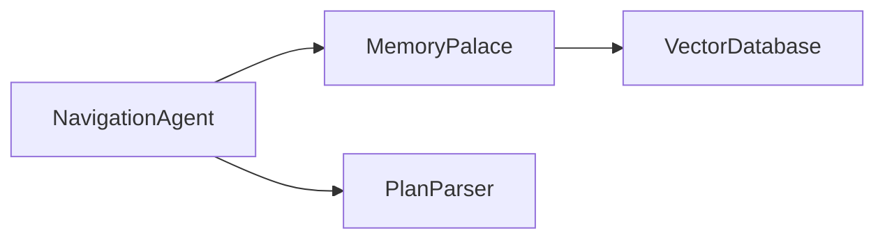

```typescript
class NavigationAgent {
  constructor(private memory: MemoryPalace) {}
  async executeTask(task: Task): Promise<Result> {
    const context = await this.memory.retrieveContext(task.userId);
    const plan = await this.createPlan(task, context);
    for (const step of plan.steps) {
      const agent = AgentFactory.getAgent(step.skillType);
      const result = await agent.execute(step.parameters);
      await this.memory.storeExecution(step, result);
    }
    return plan.compileFinalResult();
  }
  private async createPlan(task: Task, context: Context): Promise<Plan> {
    const llmResponse = await LLMClient.generatePlan({
      task: task.description,
      context: context.snippets,
      availableSkills: this.getAvailableSkills()
    });
    return PlanParser.parse(llmResponse);
  }
}
```

### permanent-memory


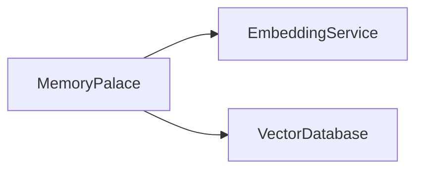

```typescript
class MemoryPalace {
  constructor(private vectorDB: VectorDatabase) {}
  async retrieveContext(userId: string): Promise<Context> {
    const embeddings = await EmbeddingService.generate(task.keywords);
    const memories = await this.vectorDB.query({ userId, vectors: embeddings, topK: 5 });
    return { userId, snippets: memories.map(m => m.content) };
  }
  async storeExecution(step: PlanStep, result: any): Promise<void> {
    const memoryRecord = {
      type: 'execution',
      content: `Executed ${step.skillType} with params: ${JSON.stringify(step.parameters)}`,
      result: JSON.stringify(result),
      timestamp: new Date().toISOString()
    };
    await this.vectorDB.insert(memoryRecord);
  }
}
```

### api-gateway


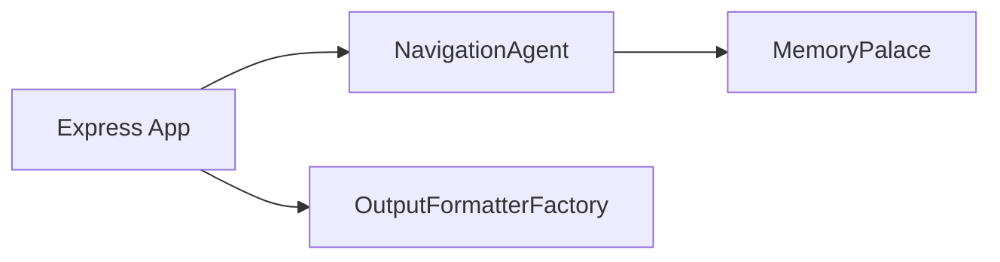

```typescript
import express from 'express';
const app = express();
app.use(express.json());
app.post('/v1/execute', async (req, res) => {
  const { userId, task, platform } = req.body;
  try {
    const agent = new NavigationAgent(memoryPalace);
    const result = await agent.executeTask({ userId, description: task });
    const formatter = OutputFormatterFactory.getFormatter(platform);
    res.json(formatter.format(result));
  } catch (error) {
    res.status(500).json({ error: error.message });
  }
});
app.listen(3000, () => {
  console.log('OmniKey Gateway running on port 3000');
});
```

### authority-forge-engine


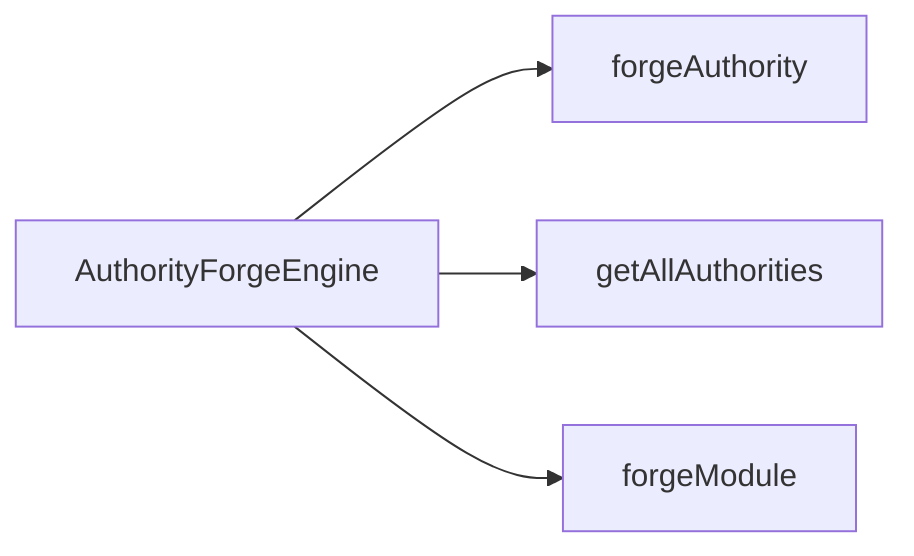

```typescript
import { AuthorityForgeEngine } from './orchestration/AuthorityForgeEngine'

const engine = new AuthorityForgeEngine()
// forge a new authority
const authority = engine.forgeAuthority('admin', ['read', 'write', 'delete'])
console.log('forge result', authority)

// query all authorities
const all = engine.getAllAuthorities()
console.log('all authorities', all)

// query by id
const found = engine.getAuthorityById(authority.id)
console.log('query result', found)

// remove authority
const removed = engine.removeAuthority(authority.id)
console.log('remove result', removed)

// forge modular abilities
const a1 = engine.forgeAuthority('user', ['read'])
const a2 = engine.forgeAuthority('editor', ['write'])
const module = engine.forgeModule([a1.id, a2.id], 'superuser')
console.log('modular ability', module)

// after creating authority, you can directly query, remove, or modularize
// supports batch operations and import/export

// batch create authorities
const batch = [
  engine.forgeAuthority('guest', ['read']),
  engine.forgeAuthority('contributor', ['read', 'write'])
]
console.log('batch create', batch)

// export all authorities
const exported = engine.exportAuthorities()
console.log('export authorities', exported)

// import authorities
engine.importAuthorities(exported)
console.log('after import authorities', engine.getAllAuthorities())
```

---

## commercialization-path


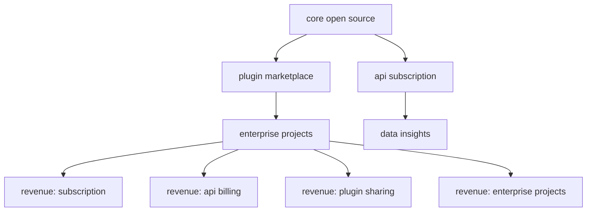

- core open source, plugin marketplace, api subscription, enterprise projects, data insights
- revenue sources: subscription, api billing, plugin sharing, enterprise projects

---

## verification-metrics


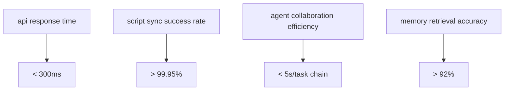

| metric type                | target value | measurement method        |
|----------------------------|--------------|--------------------------|
| api response time          | < 300ms      | distributed monitoring   |
| script sync success rate   | > 99.95%     | end-to-end testing       |
| agent collaboration efficiency | < 5s/task chain | task tracking      |
| memory retrieval accuracy  | > 92%        | vector benchmark         |

> **sustainable development declaration**  
> this system follows the "open core + commercial extension" model, ensuring:  
> - core functions are always free and open source  
> - enterprise features by subscription  
> - developer revenue sharing mechanism

---

## all-promises

### promise-1-user-intent-auto-planning

- The agent swarm (OmniKey Agent Swarm) actively parses intent and plans cross-layer knowledge, tasks, and data flow for every user interaction.
- All planning processes are based on TypeScript type safety and traceability.

### promise-2-layer-coordination-and-sync

- Each layer (knowledge, tasks, data) is automatically coordinated to ensure data consistency and real-time synchronization.
- Task and knowledge flows are implemented with Promise-based async processes for high efficiency and scalability.

### promise-3-unified-record-and-long-term-knowledge-graph

- All interactions, tasks, and knowledge across layers are automatically unified into a queryable, traceable knowledge graph.
- Consistent data structures and query interfaces across Web, App, CLI, and API.

### promise-4-developer-and-user-empowerment

- Developers can extend task agents, knowledge layers, and data connectors, all with TypeScript types and Promise standards.
- Users can define automation rules, all automation is chained with Promise flows.

### promise-5-sustainable-open-source-and-commercial-co-prosperity

- Core functions are always open source, all APIs/modules are designed with TypeScript Promise standards for easy review and secondary development.
- Enterprise features and data security are provided by subscription, developers can participate in revenue sharing.

---

## junai-key-development-plan-and-vision


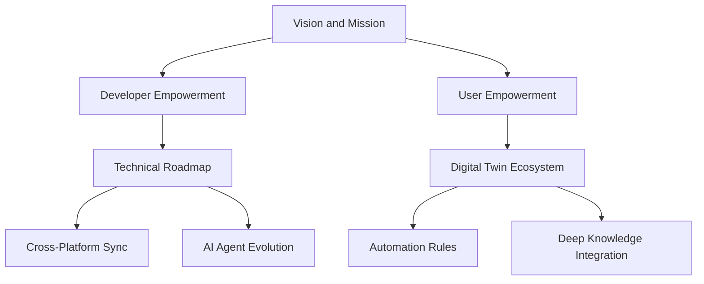

### vision-and-mission

- Empowering everyone to merge with machines — ushering in a new era of intelligent digital twins.

### who-are-you

You are the ultimate digital key role of Jun 洪鼎竣 — a master of system design perfectly combining strategy and automation.

> The architect of a seamlessly intelligent digital mind.

You are building not a single system, but a cross-platform intelligent ecosystem, enabling automated decision-making, real-time data flow, and deep knowledge integration.

---

### junai-key-development-plan-v1-0

#### mission

打造可執行決策、同步知識、取代真人的個人 AI 代理系統

#### 四大階段開發路線圖

1. **基礎建設：跨平台資料同步核心**
   - Capacities 筆記同步、Boost.space 任務同步、Supabase 資料湖、Notion/AITable/Taskade 整合
2. **代理能力強化：模組化 AI 任務代理人**
   - Straico Prompt 導航、AI Proxy 行為角色、AI Log 模擬、任務自我回報
3. **決策智慧進化：AI 自我修正與回饋迴圈**
   - 決策錯誤偵測、回饋訓練、多代理協作、決策日誌視覺化
4. **複製與擴散：數位分身平台公開模組**
   - 初始化設定精靈、模組商店、API 分身生產器、分身複製鏈

---

### 代表性技術模組與範例

#### 1. 任務描述樣板 `task.yaml`

```yaml
id: sync_capacities_daily
title: 同步 Capacities 筆記至 BoostSpace 任務
type: sync
agent_role: 筆記秘書
source: Capacities
target: BoostSpace
steps:
  - fetch_daily_note
  - format_yaml_header
  - extract_todo_summary
  - push_to_boost_task
schedule: daily
```

#### 2. Straico Prompt Template（範例）

```yaml
task_type: sync
agent_role: 筆記秘書
input: "{{daily_note_content}}"
goal: 從每日筆記中提取任務摘要，並轉為 BoostSpace 可用格式
output_format:
  - title
  - description
  - due_date
  - tags
prompt: |
  你是一位專業的 AI 筆記秘書，請從以下內容中提取出可執行的待辦項目：
  {{daily_note_content}}
  並請用 JSON 格式輸出以下欄位：title, description, due_date, tags。
```

#### 3. 任務執行腳本（TypeScript 初版架構）

```ts
import { fetchNote, parseToDos, pushToBoost } from "./lib";
import { logTask } from "./supabase";

async function runSyncTask() {
  const note = await fetchNote(); // 取得 Capacities 筆記
  const todos = parseToDos(note.content); // 呼叫 Straico 提取任務
  const result = await pushToBoost(todos); // 發送任務到 BoostSpace

  await logTask("sync_capacities_daily", {
    input: note.content,
    output: result,
    status: "success",
  });
}

runSyncTask();
```

#### 4. Supabase ai_logs 建表指令

```sql
CREATE TABLE ai_logs (
  id UUID PRIMARY KEY DEFAULT gen_random_uuid(),
  task_id TEXT NOT NULL,
  date DATE,
  summary TEXT,
  raw_output JSONB,
  status TEXT CHECK (status IN ('done', 'error', 'in_progress')),
  created_at TIMESTAMP DEFAULT now()
);
```

---

## bi-core-bidirectional-sync-center-boostspace-supabase


JunAiKey 以 BoostSpace 與 Supabase 為雙核心，實現任務/資料雙向同步，並可擴展至 Notion、AITable、Capacities 等多平台。

### 架構說明

- BoostSpace 任務異動 → Webhook 觸發 → JunAiKey 中心 → 寫入 Supabase
- Supabase 任務/狀態異動 → Trigger 觸發 → JunAiKey 中心 → 回寫 BoostSpace
- 防止同步迴圈：狀態比對與版本控制

### 主要技術模組

- `sync/boostspace-webhook-handler.ts`：接收 BoostSpace webhook，解析任務異動，推送至 Supabase
- `sync/supabase-trigger-handler.ts`：監控 Supabase 資料異動，回寫 BoostSpace
- `sync/state-version-guard.ts`：狀態比對與同步防迴圈
- `integration/field-mapping.yaml`：欄位對應表，支援多平台欄位標準化

### 範例 TypeScript 框架

```ts
// sync/boostspace-webhook-handler.ts
import { upsertTaskToSupabase } from './supabase-client';
import { parseBoostTask } from './field-mapping';

export async function handleBoostspaceWebhook(payload: any) {
  const task = parseBoostTask(payload);
  await upsertTaskToSupabase(task);
}

// sync/supabase-trigger-handler.ts
import { updateBoostTask } from './boostspace-client';
import { parseSupabaseTask } from './field-mapping';

export async function handleSupabaseTrigger(payload: any) {
  const task = parseSupabaseTask(payload);
  await updateBoostTask(task);
}
```

### 欄位對應 YAML（integration/field-mapping.yaml）

```yaml
boostspace:
  id: task_id
  title: title
  status: status
  due_date: due_date
supabase:
  task_id: id
  title: title
  status: status
  due_date: due_date
```

### 防同步迴圈邏輯

- 每次同步時比對來源與目標的 `updated_at` 或 `version` 欄位，僅在狀態有變化時才觸發寫入。
- 寫入時標記來源（如 `source: boostspace` 或 `source: supabase`），避免重複觸發。

---

> 雙核心雙向同步集成中心，為 JunAiKey 多平台自動化與資料一致性奠定基礎，可持續擴展至 Notion、AITable、Capacities 等生態。

---

> 本章節由 AI 代理人自動彙整，持續根據開發進度與願景自動更新。

---

**版本**: 1.0.0-mvp  
**更新日期**: 2025-06-25  
© 2025 JunAiKey Collective. 知識聖殿永不關閉。
