# junai-key-universal-system

> in the sanctum of knowledge, self-navigating agents perpetually forge authorities and engrave runes, advancing at light speed through the corridors of memory.

---

## file-index

- [readme.md](./README.md): main narrative, architecture, story modules, technical layers
- [docs/prd.md](./docs/PRD.md): product requirements
- [docs/spec.md](./docs/SPEC.md): product specification
- [docs/api_library.md](./docs/API_LIBRARY.md): api documentation
- [docs/api_library.yaml](./docs/API_LIBRARY.yaml): api spec yaml
- [docs/contributing.md](./docs/CONTRIBUTING.md): contributing guide
- [docs/faq.md](./docs/FAQ.md): faq
- [images/junaikey-infinity-loop.svg](./images/junaikey-infinity-loop.svg): main visual

> if missing, please create a blank template. if orphaned files exist, please remove them.

---

## mece-analysis


> all capabilities in junai-key are designed with the mece principle: each pillar, arcana, and secret is independent and non-overlapping, together covering the full spectrum of intelligent evolution.
>
> **user-centric saas ai platform**: junai-key is not just a developer automation tool, but a digital twin, knowledge assistant, and action hub for every user. all design, api, sync, plugins, and the universal key app (supporting zh/en input) are built for user experience, data sovereignty, and personal empowerment.

### the-four-pillars

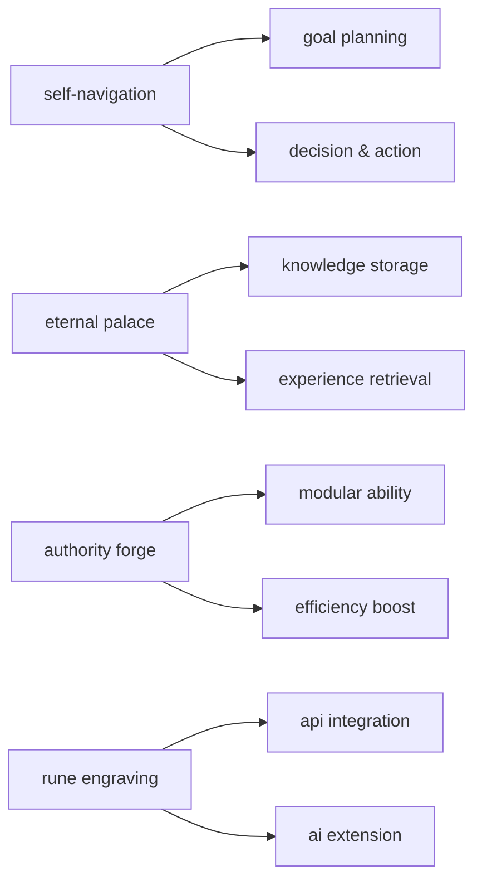

1. **self-navigation**: goal planning, decision and action path, ensuring clear task direction.
2. **eternal palace**: knowledge, experience, and feedback storage and retrieval, supporting long-term learning.
3. **authority forge**: modularizing repetitive or complex tasks for efficiency and customization.
4. **rune engraving**: integrating external api and ai capabilities for continuous evolution.

---

### the-six-arcana

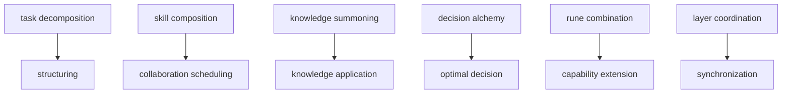

- **task decomposition**: breaking down complex goals into clear steps, focusing on structure.
- **skill composition**: flexibly combining multiple abilities, focusing on collaboration and scheduling.
- **knowledge summoning**: instant retrieval and application of knowledge from the eternal palace.
- **decision alchemy**: fusing multi-source information for optimal decisions.
- **rune combination**: integrating external api/plugins as runes for capability extension.
- **layer coordination**: automatic cross-platform, cross-layer data and task coordination for consistency.

---

### the-grand-secret

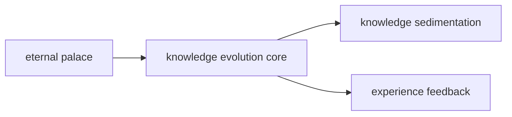

- **eternal palace**: the sole evolution core, where all knowledge, experience, and task feedback are sedimented and evolved into an everlasting wisdom repository.

---

## toc

- [project-vision-and-positioning](#project-vision-and-positioning)
- [project-structure](#project-structure)
- [architecture-panorama](#architecture-panorama)
- [quick-start](#quick-start)
- [ci-cd-automation](#ci-cd-automation)
- [core-module-examples](#core-module-examples)
- [commercialization-path](#commercialization-path)
- [verification-metrics](#verification-metrics)
- [all-promises](#all-promises)
- [junai-key-development-plan-and-vision](#junai-key-development-plan-and-vision)
- [bi-core-bidirectional-sync-center-boostspace-supabase](#bi-core-bidirectional-sync-center-and-agent-group)
- [dual-core-sync-integration-center-and-agent-group](#dual-core-sync-integration-center-and-agent-group)

---

## project-vision-and-positioning


- user-centric, building a self-evolving, knowledge-sustaining, community-collaborating ai intelligent agent platform.
- four core pillars (self-navigation, eternal palace, authority forge, rune engraving) form the evolution flywheel, driving continuous evolution of individual and collective intelligence.
- multi-platform api integration, agent collaboration, sync, automation, supporting cli, web, app, webhook.
- not just a tool, but a digital life's "universal key" and a personal/team digital twin.

---

## project-structure


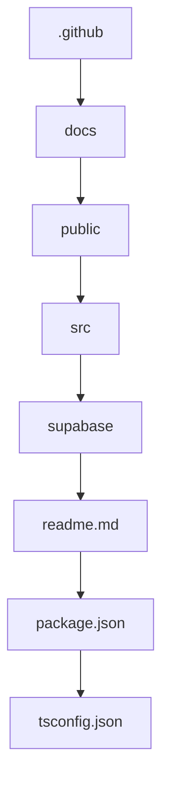

````text
jun-ai-key/
├── .github/workflows/ci.yml, deploy.yml
├── docs/SPEC.md, API_LIBRARY.md
├── public/index.html
├── src/
│   ├── api/straicoApi.ts, boostApi.ts, capacitiesApi.ts
│   ├── components/, hooks/, models/, scriptApp/, styles/
│   ├── App.tsx, index.tsx
├── supabase/migrations/, functions/
├── .env.example
├── README.md
├── package.json
├── tsconfig.json
└── SPEC.md
````

---

## architecture-panorama


> **core concept: user-centric**
> all designs, architectures, processes, apis, knowledge graphs, and automations in junai-key are prioritized to meet user needs, ensuring every function proactively understands, coordinates, and fulfills the user's true intentions and long-term growth.

> in the sanctum of knowledge, self-navigating agents perpetually forge authorities and engrave runes, advancing at light speed through the corridors of memory.

---

## junai-key-project-highlights (2025/06/11)

### 1. vision-and-positioning

- user-centric, building a self-evolving, knowledge-sustaining, community-collaborating ai intelligent agent platform.
- not just a tool, but a digital life's "universal key" and a personal/team digital twin.

### 2. architecture-overview

- four core pillars (self-navigation, eternal palace, authority forge, rune engraving) form the evolution flywheel, driving continuous evolution of individual and collective intelligence.
- junai-key as the sole hub, integrating boostspace, supabase, capacities, aitables, github, notion, etc., achieving multi-end sync, data aggregation, api/plugin ecosystem.

### 3. mvp-deliverables

- multi-platform api integration, function agent groups, group agents, scripting cli, desktop/mobile sync, automated testing.
- tech stack: typescript, node.js, supabase, github actions, self-developed agent modules.
- delivery format: open-source project, readme, api/plugin standards, script examples, ci/cd processes.

### 4. tech-highlights

- modular architecture, cross-end real-time sync, low code threshold, built-in automated testing, open plugin/agent ecosystem.
- supports cli, webhook, desktop, frontend, mobile, and other multi-end collaboration and automation.

### 5. evolution-flywheel-and-knowledge-sedimentation

- eternal palace: knowledge accumulation and decision-making foundation, structured knowledge graph.
- self-navigation: proactive planning and intelligent decision-making, action results feedback to memory.
- authority forge: modularizing repetitive/complex tasks into dedicated abilities, driving personal evolution.
- rune engraving: seamless integration of global ai capabilities, continuous evolution and expansion.

### 6. practical-applications

- multi-platform task/data bi-directional sync, knowledge/task intelligence command center, automated processes, community co-creation.
- yaml/csv task examples can be directly imported into github project, notion, aitables, and other collaboration platforms.

### 7. sustainable-development-declaration

- open-source core, commercial expansion, developer revenue sharing, enterprise-level feature subscription, the sanctum of knowledge never closes.

---

## architecture-panorama | architecture panorama


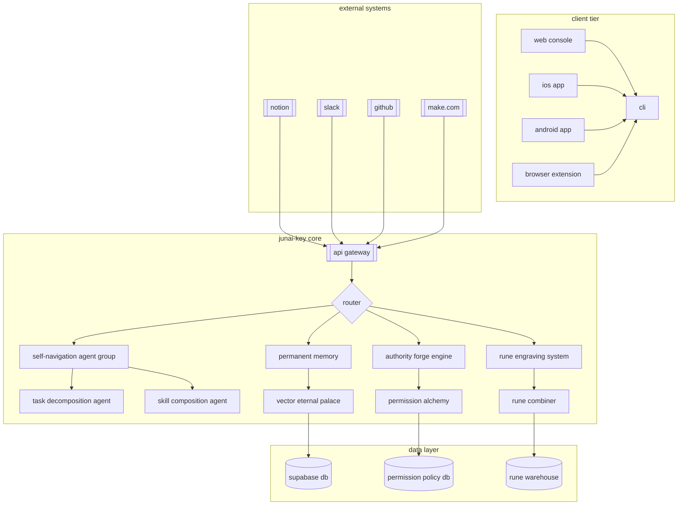

---

## quick-start

1. install node.js, npm, supabase cli

2. copy `.env.example` to `.env` and fill in the keys

3. install dependencies and start:

    ```bash
    git clone https://github.com/<account>/jun-ai-key.git
    cd jun-ai-key
    npm install
    npm start
    ```

4. edge functions debugging:

    ```bash
    cd supabase/functions
    supabase functions serve
    ```

---

## ci-cd-automation

- `.github/workflows/ci.yml`: auto lint, build, test
- `.github/workflows/deploy.yml`: auto deploy github pages & supabase edge functions on main branch

---

## core-module-examples

### self-navigation-agent-group


<!-- ENGLISH -->
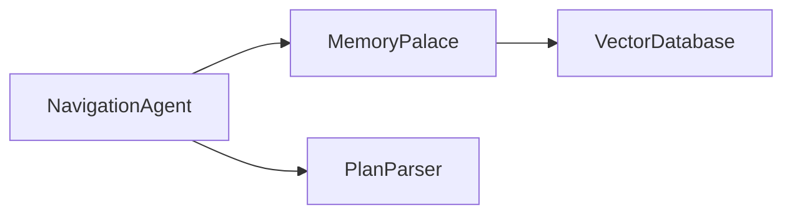

```typescript
class NavigationAgent {
  constructor(private memory: MemoryPalace) {}
  async executeTask(task: Task): Promise<Result> {
    const context = await this.memory.retrieveContext(task.userId);
    const plan = await this.createPlan(task, context);
    for (const step of plan.steps) {
      const agent = AgentFactory.getAgent(step.skillType);
      const result = await agent.execute(step.parameters);
      await this.memory.storeExecution(step, result);
    }
    return plan.compileFinalResult();
  }
  private async createPlan(task: Task, context: Context): Promise<Plan> {
    const llmResponse = await LLMClient.generatePlan({
      task: task.description,
      context: context.snippets,
      availableSkills: this.getAvailableSkills()
    });
    return PlanParser.parse(llmResponse);
  }
}
```

<!-- 中文 -->
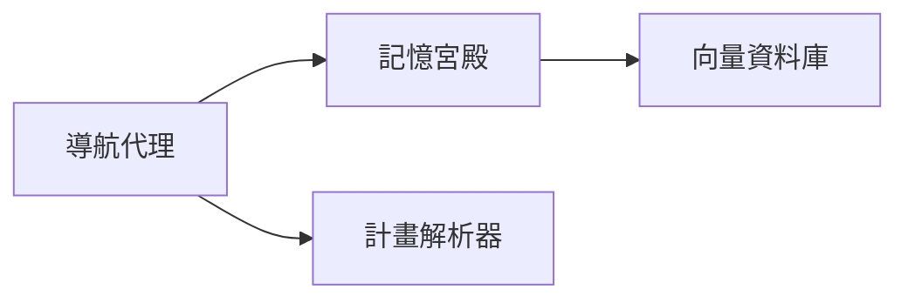

```typescript
class NavigationAgent {
  constructor(private memory: MemoryPalace) {}
  async executeTask(task: Task): Promise<Result> {
    const context = await this.memory.retrieveContext(task.userId);
    const plan = await this.createPlan(task, context);
    for (const step of plan.steps) {
      const agent = AgentFactory.getAgent(step.skillType);
      const result = await agent.execute(step.parameters);
      await this.memory.storeExecution(step, result);
    }
    return plan.compileFinalResult();
  }
  private async createPlan(task: Task, context: Context): Promise<Plan> {
    const llmResponse = await LLMClient.generatePlan({
      task: task.description,
      context: context.snippets,
      availableSkills: this.getAvailableSkills()
    });
    return PlanParser.parse(llmResponse);
  }
}
// 導航代理會根據任務與記憶自動規劃步驟，並執行每個技能，將結果存入記憶宮殿。
```

---

### permanent-memory


<!-- ENGLISH -->
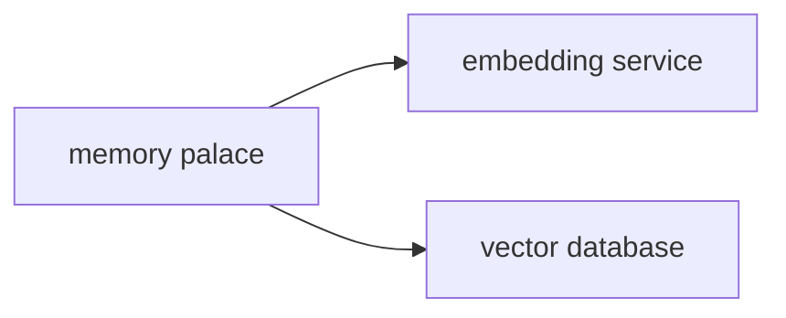

```typescript
class MemoryPalace {
  constructor(private vectorDB: VectorDatabase) {}
  async retrieveContext(userId: string): Promise<Context> {
    const embeddings = await EmbeddingService.generate(task.keywords);
    const memories = await this.vectorDB.query({ userId, vectors: embeddings, topK: 5 });
    return { userId, snippets: memories.map(m => m.content) };
  }
  async storeExecution(step: PlanStep, result: any): Promise<void> {
    const memoryRecord = {
      type: 'execution',
      content: `executed ${step.skillType} with params: ${JSON.stringify(step.parameters)}`,
      result: JSON.stringify(result),
      timestamp: new Date().toISOString()
    };
    await this.vectorDB.insert(memoryRecord);
  }
}
```

<!-- 中文 -->
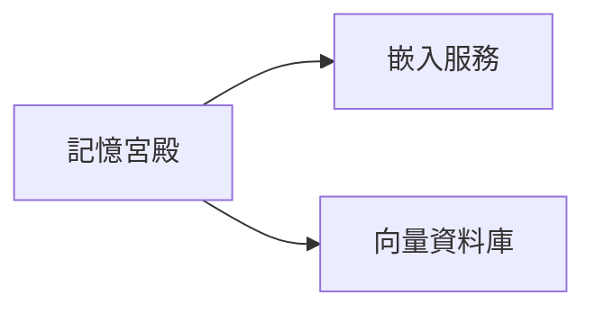

```typescript
class MemoryPalace {
  constructor(private vectorDB: VectorDatabase) {}
  async retrieveContext(userId: string): Promise<Context> {
    const embeddings = await EmbeddingService.generate(task.keywords);
    const memories = await this.vectorDB.query({ userId, vectors: embeddings, topK: 5 });
    return { userId, snippets: memories.map(m => m.content) };
  }
  async storeExecution(step: PlanStep, result: any): Promise<void> {
    const memoryRecord = {
      type: 'execution',
      content: `執行 ${step.skillType}，參數: ${JSON.stringify(step.parameters)}`,
      result: JSON.stringify(result),
      timestamp: new Date().toISOString()
    };
    await this.vectorDB.insert(memoryRecord);
  }
}
// 記憶宮殿用於儲存與檢索任務執行記錄與知識片段，支援語意查詢。
```

---

### api-gateway


<!-- ENGLISH -->
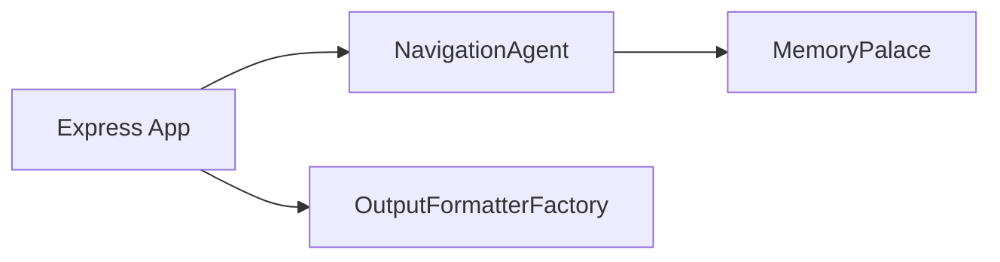

```typescript
import express from 'express';
const app = express();
app.use(express.json());
app.post('/v1/execute', async (req, res) => {
  const { userId, task, platform } = req.body;
  try {
    const agent = new NavigationAgent(memoryPalace);
    const result = await agent.executeTask({ userId, description: task });
    const formatter = OutputFormatterFactory.getFormatter(platform);
    res.json(formatter.format(result));
  } catch (error) {
    res.status(500).json({ error: error.message });
  }
});
app.listen(3000, () => {
  console.log('OmniKey Gateway running on port 3000');
});
```

<!-- 中文 -->
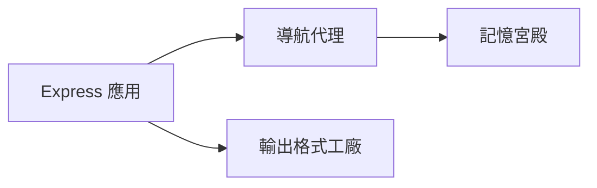

```typescript
import express from 'express';
const app = express();
app.use(express.json());
app.post('/v1/execute', async (req, res) => {
  const { userId, task, platform } = req.body;
  try {
    const agent = new NavigationAgent(memoryPalace);
    const result = await agent.executeTask({ userId, description: task });
    const formatter = OutputFormatterFactory.getFormatter(platform);
    res.json(formatter.format(result));
  } catch (error) {
    res.status(500).json({ error: error.message });
  }
});
app.listen(3000, () => {
  console.log('OmniKey Gateway 埠口 3000 啟動');
});
// API 網關負責接收請求，調用導航代理與記憶宮殿，並根據平台格式化輸出。
```

---

#### Extensibility & Design Notes | 擴展性與設計說明

---

##### 1. Design Principles & SOLID | 設計原則與 SOLID

- **Open/Closed Principle (OCP) 開放封閉原則**：
  - EN: All extension points (formatters, agents, middleware) are open for extension, closed for modification. This ensures core stability and flexible extensibility.
  - 中文：所有擴展點（格式工廠、代理、中間件）皆遵循 OCP，核心穩定、擴展靈活。
- **SOLID Principles**：
  - EN: Follow SOLID (Single Responsibility, Open/Closed, Liskov Substitution, Interface Segregation, Dependency Inversion) for maintainable, scalable, and testable code.
  - 中文：遵循 SOLID 原則，確保程式碼可維護、可擴展、易於測試。
- **TypeScript Type Safety 型別安全**：
  - EN: Use strict interfaces, abstract classes, and type guards to ensure extensibility safety and cross-team clarity.
  - 中文：嚴格型別（interface/abstract class/type guard）有助於國際團隊協作與維護。
- **Bilingual Documentation 雙語文件**：
  - EN: For international teams, always provide bilingual comments and docs.
  - 中文：國際協作建議雙語註解與說明。

---

##### 2. Extensibility Patterns | 擴展模式

- **Plugin-based OutputFormatterFactory 插件化輸出格式工廠**：
  - EN: Add new output formats (Slack, CLI, Webhook, Mobile) by implementing and registering a formatter.
  - 中文：實作並註冊 formatter，即可支援多平台格式。
- **Middleware Support 中間件支援**：
  - EN: Express middleware is pluggable for authentication, logging, rate limiting, CORS, etc.
  - 中文：Express 中間件可插拔，支援認證、日誌、速率限制、跨域等。
- **Agent Injection 代理注入**：
  - EN: Inject different agent/memory instances based on platform or request content.
  - 中文：可根據平台或請求內容注入不同 agent/memory 實例。
- **API Versioning API 版本管理**：
  - EN: Path design supports /v1/, /v2/ for smooth upgrades.
  - 中文：路徑設計支援多版本共存，便於升級。

---

##### 3. Plugin Auto-Discovery & Registration | 插件自動發現與註冊

- **Auto-Discovery 自動發現**：
  - EN: Use dynamic import, glob, or registry pattern to auto-load plugins for large-scale/multi-platform scenarios.
  - 中文：動態 import、glob、註冊表模式適用於大型協作與多平台擴展。
- **Type Validation 型別驗證**：
  - EN: Validate plugin types at load time to ensure interface compliance.
  - 中文：載入時驗證型別，確保介面一致。

```typescript
// Example: Auto-discover plugins (Node.js, ESM)
import { OutputFormatterFactory } from '../OutputFormatterFactory';
import fs from 'fs';
import path from 'path';
const pluginDir = path.join(__dirname, './formatters');
for (const file of fs.readdirSync(pluginDir)) {
  if (file.endsWith('.js')) {
    const { default: Formatter, platform } = require(path.join(pluginDir, file));
    // Type guard example
    if (typeof Formatter === 'function' && typeof platform === 'string') {
      OutputFormatterFactory.register(platform, Formatter);
    }
  }
}
```

---

##### 4. Extensibility Best Practices | 擴展性最佳實踐

- **Centralized Plugin Management 插件集中管理**：
  - EN: Register plugins in a single location for maintainability.
  - 中文：插件註冊集中管理，便於維護。
- **Comprehensive Documentation 完整文件**：
  - EN: Document all extension points and provide usage examples.
  - 中文：所有擴展點需有文件與範例。
- **Code Review & Automated Testing 代碼審查與自動化測試**：
  - EN: All plugins must pass code review and automated tests.
  - 中文：插件需經過審查與自動化測試。
- **Bilingual Comments & Docs 雙語註解與說明**：
  - EN: Use English and 中文 for all key comments and docs.
  - 中文：重要註解與說明建議雙語。
- **CI/CD Integration 持續整合/部署**：
  - EN: Integrate plugin checks into CI/CD pipelines for quality assurance.
  - 中文：將插件檢查納入 CI/CD 流程，確保品質。

---

##### 5. Common Pitfalls & Anti-Patterns | 常見失敗案例與反模式

- **Tight Coupling 緊耦合**：
  - EN: Avoid hardcoding plugin logic in core modules.
  - 中文：避免在核心模組硬編碼插件邏輯。
- **Lack of Type Safety 缺乏型別安全**：
  - EN: Always use interfaces and type guards for plugin contracts.
  - 中文：插件合約務必用 interface/type guard 保證型別安全。
- **Missing Documentation 文件缺失**：
  - EN: Incomplete docs hinder international collaboration.
  - 中文：文件不全會阻礙國際協作。

---

##### 6. FAQ: Extensibility & Collaboration | 常見問答：擴展性與協作

- **Q: How to add a new platform formatter? 如何新增平台格式化器？**
  - EN: Implement the formatter, export as default, and register in the factory or auto-discovery folder.
  - 中文：實作 formatter，export default，並註冊於工廠或自動發現目錄。
- **Q: How to ensure plugin type safety? 如何確保插件型別安全？**
  - EN: Use TypeScript interfaces, abstract classes, and runtime type guards.
  - 中文：用 TypeScript interface/abstract class 與執行期 type guard。
- **Q: How to support hot-reload for plugins? 如何支援插件熱插拔/動態 reload？**
  - EN: Use file watchers and dynamic import to reload plugins at runtime.
  - 中文：用檔案監聽與動態 import，實現執行期 reload。

---

> The API Gateway is designed for maximum extensibility, security, and internationalization. All best practices are recommended for production deployments.

---

## commercialization-path


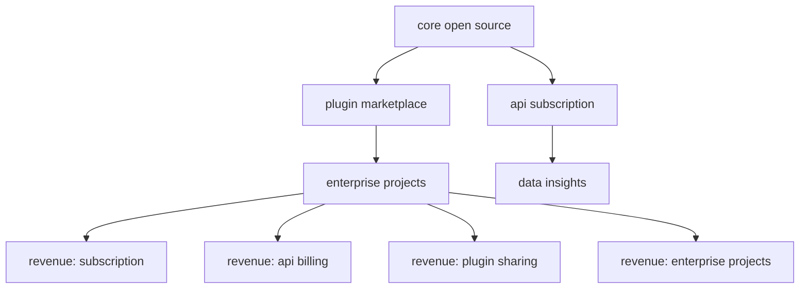

- core open source, plugin marketplace, api subscription, enterprise projects, data insights
- revenue sources: subscription, api billing, plugin sharing, enterprise projects

---

## verification-metrics


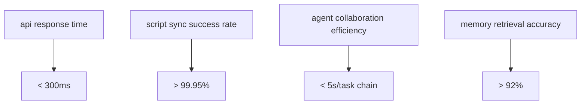

| metric type                | target value | measurement method        |
|----------------------------|--------------|--------------------------|
| api response time          | < 300ms      | distributed monitoring   |
| script sync success rate   | > 99.95%     | end-to-end testing       |
| agent collaboration efficiency | < 5s/task chain | task tracking      |
| memory retrieval accuracy  | > 92%        | vector benchmark         |

> **sustainable development declaration**  
> this system follows the "open core + commercial extension" model, ensuring:  
> - core functions are always free and open source  
> - enterprise features by subscription  
> - developer revenue sharing mechanism

---

## all-promises

### promise-1-user-intent-auto-planning

- The agent swarm (OmniKey Agent Swarm) actively parses intent and plans cross-layer knowledge, tasks, and data flow for every user interaction.
- All planning processes are based on TypeScript type safety and traceability.

### promise-2-layer-coordination-and-sync

- Each layer (knowledge, tasks, data) is automatically coordinated to ensure data consistency and real-time synchronization.
- Task and knowledge flows are implemented with Promise-based async processes for high efficiency and scalability.

### promise-3-unified-record-and-long-term-knowledge-graph

- All interactions, tasks, and knowledge across layers are automatically unified into a queryable, traceable knowledge graph.
- Consistent data structures and query interfaces across Web, App, CLI, and API.

### promise-4-developer-and-user-empowerment

- Developers can extend task agents, knowledge layers, and data connectors, all with TypeScript types and Promise standards.
- Users can define automation rules, all automation is chained with Promise flows.

### promise-5-sustainable-open-source-and-commercial-co-prosperity

- Core functions are always open source, all APIs/modules are designed with TypeScript Promise standards for easy review and secondary development.
- Enterprise features and data security are provided by subscription, developers can participate in revenue sharing.

---

## junai-key-development-plan-and-vision


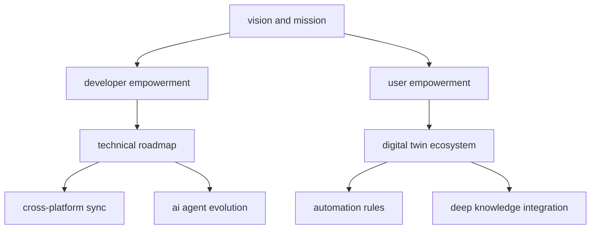

### vision-and-mission

- empowering everyone to merge with machines — ushering in a new era of intelligent digital twins.

### who-are-you

you are the ultimate digital key role — a master of system design perfectly combining strategy and automation.

> the architect of a seamlessly intelligent digital mind.

you are building not a single system, but a cross-platform intelligent ecosystem, enabling automated decision-making, real-time data flow, and deep knowledge integration.

### junai-key-development-plan-v1-0

#### mission

build an ai agent system capable of executable decision-making, knowledge sync, and replacing human agents.

#### four-stage-development-roadmap

1. **infrastructure: cross-platform data sync core**
   - capacities note sync, boostspace task sync, supabase data lake, notion/aitable/taskade integration
2. **agent capability enhancement: modular ai task agents**
   - straico prompt navigation, ai proxy behavior roles, ai log simulation, self-reporting tasks
3. **decision intelligence evolution: ai self-correction and feedback loop**
   - decision error detection, feedback training, multi-agent collaboration, decision log visualization
4. **replication and diffusion: digital twin platform public modules**
   - setup wizard, module marketplace, api twin generator, twin replication chain

---

### representative-technical-modules-and-examples

#### 1. task description template (`task.yaml`)

```yaml
id: sync_capacities_daily
title: sync capacities notes to boostspace tasks
type: sync
agent_role: note secretary
source: capacities
target: boostspace
steps:
  - fetch_daily_note
  - format_yaml_header
  - extract_todo_summary
  - push_to_boost_task
schedule: daily
```

#### 2. straico prompt template (example)

```yaml
prompt: "extract all todo items from the following note and summarize as tasks."
input: |
  - [ ] buy milk
  - [x] finish report
  - [ ] schedule meeting
output:
  - buy milk
  - schedule meeting
```

#### 3. task execution script (typescript example)

```ts
import { fetchNote, parseToDos, pushToBoost } from "./lib";
import { logTask } from "./supabase";

async function runSyncTask() {
  const note = await fetchNote(); // get capacities note
  const todos = parseToDos(note.content); // extract tasks via straico
  const result = await pushToBoost(todos); // send tasks to boostspace

  await logTask("sync_capacities_daily", {
    input: note.content,
    output: result,
    status: "success",
  });
}

runSyncTask();
```

#### 4. supabase ai_logs table schema

```sql
CREATE TABLE ai_logs (
  id UUID PRIMARY KEY DEFAULT gen_random_uuid(),
  task_id TEXT NOT NULL,
  date DATE,
  summary TEXT,
  raw_output JSONB,
  status TEXT CHECK (status IN ('done', 'error', 'in_progress')),
  created_at TIMESTAMP DEFAULT now()
);
```

---

## bi-core-bidirectional-sync-center-boostspace-supabase


> **Section Overview**
>
> This section introduces the bi-core bidirectional sync center, which forms the foundation for multi-platform automation and data consistency in junai-key. The architecture is extensible to Notion, AITable, Capacities, and more. Both English and Chinese explanations are provided for clarity and international collaboration.

---

### Architecture Overview

#### English

junai-key uses Boostspace and Supabase as dual cores to achieve robust, bidirectional task/data sync. The design is extensible to other platforms.

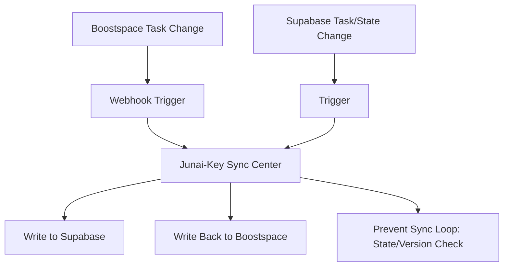

#### 中文

junai-key 以 Boostspace 與 Supabase 為雙核心，實現多平台任務/資料雙向同步，架構可延伸至 Notion、AITable、Capacities 等。

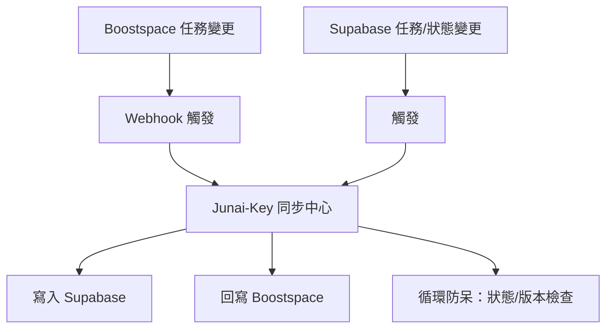

---

### Main Technical Modules

| Module File                          | Description (EN)                                         | 說明（中文）                        | Key Responsibilities (EN)                                   | 主要職責（中文）                      |
|--------------------------------------|----------------------------------------------------------|-------------------------------------|-------------------------------------------------------------|---------------------------------------|
| sync/boostspace-webhook-handler.ts   | Receives Boostspace webhook, parses task changes, pushes to Supabase | 接收 Boostspace webhook，解析任務變更，推送至 Supabase | 1. Listen to Boostspace webhooks<br>2. Parse and map task data<br>3. Upsert to Supabase | 1. 監聽 Boostspace webhook<br>2. 解析並映射任務資料<br>3. 寫入 Supabase |
| sync/supabase-trigger-handler.ts     | Monitors Supabase data changes, writes back to Boostspace | 監控 Supabase 資料變更，回寫 Boostspace | 1. Watch Supabase triggers<br>2. Parse and map task data<br>3. Update Boostspace | 1. 監控 Supabase 觸發器<br>2. 解析並映射任務資料<br>3. 回寫 Boostspace |
| sync/state-version-guard.ts          | State comparison and sync loop prevention                 | 狀態比對與循環防呆                   | 1. Compare state/version fields<br>2. Prevent sync loops<br>3. Mark sync source | 1. 比對狀態/版本欄位<br>2. 防止同步循環<br>3. 標記同步來源 |
| integration/field-mapping.yaml       | Field mapping table, supports multi-platform field standardization | 欄位對應表，支援多平台欄位標準化         | 1. Define cross-platform field mapping<br>2. Enable extensibility | 1. 定義跨平台欄位對應<br>2. 支援擴展性 |

---

### TypeScript Framework Example

```typescript
// sync/boostspace-webhook-handler.ts
import { upsertTaskToSupabase } from './supabase-client';
import { parseBoostTask } from './field-mapping';

export async function handleBoostspaceWebhook(payload: any) {
  const task = parseBoostTask(payload);
  await upsertTaskToSupabase(task);
}

// sync/supabase-trigger-handler.ts
import { updateBoostTask } from './boostspace-client';
import { parseSupabaseTask } from './field-mapping';

export async function handleSupabaseTrigger(payload: any) {
  const task = parseSupabaseTask(payload);
  await updateBoostTask(task);
}
```

---

### Field Mapping YAML (integration/field-mapping.yaml)

```yaml
boostspace:
  id: task_id
  title: title
  status: status
  due_date: due_date
supabase:
  task_id: id
  title: title
  status: status
  due_date: due_date
```

---

#### 中文說明

> 雙核心雙向同步中心是 junai-key 多平台自動化與資料一致性的基石，架構可延伸至 Notion、AITable、Capacities 等。

---

### Sync Loop Prevention Logic

| 步驟 | 邏輯說明（中文）                                  | Logic (EN)                                         |
|------|--------------------------------------------------|----------------------------------------------------|
| 1    | 每次同步時，比對 `updated_at` 或 `version` 欄位   | Compare `updated_at` or `version` before syncing   |
| 2    | 寫入時標記來源（如 `source: boostspace`）         | Mark source (e.g., `source: boostspace`)           |
| 3    | 僅在狀態變更時才觸發寫入，避免重複觸發             | Only trigger write on state change, avoid loops    |

---

> This section is auto-curated by AI agents and will be continuously updated according to development progress and vision.

---

#### Advanced Plugin Development | 進階插件開發（全方位強化）

##### 1. Plugin Lifecycle Management | 插件生命週期管理

- **EN:** Support dynamic loading, unloading, hot-reloading, and versioned upgrades of plugins at runtime. Provide clear plugin registration/unregistration APIs and lifecycle hooks (onLoad, onUnload, onUpdate). For enterprise, add plugin state persistence, rollback hooks, event notification, and status query API. Document all lifecycle events for international contributors.
- **中文：** 支援執行期動態載入、卸載、熱重載與版本升級，提供明確的插件註冊/反註冊 API 與生命週期鉤子（onLoad、onUnload、onUpdate）。企業級建議加上插件狀態持久化、回滾鉤子、事件通知與狀態查詢 API，並為國際協作詳細記錄所有生命週期事件。

**Best Practices | 最佳實踐**
- EN: Always emit lifecycle events (loaded, unloaded, updated, rolled back) for observability and debugging.
- 中文：所有生命週期事件（載入、卸載、升級、回滾）應發出事件通知，便於監控與除錯。
- EN: Persist plugin state (config, version, health) for rollback and audit.
- 中文：插件狀態（設定、版本、健康）應持久化，方便回滾與稽核。
- EN: Provide a status query API for plugin health and version.
- 中文：建議提供插件健康與版本查詢 API。

**Common Pitfalls | 常見錯誤**
- EN: Forgetting to unregister or clean up resources on unload can cause memory leaks.
- 中文：卸載時未釋放資源會導致記憶體洩漏。
- EN: Not handling version downgrade/rollback gracefully may break plugin state.
- 中文：未妥善處理版本回滾，可能導致插件狀態錯亂。

```typescript
// Example: Plugin lifecycle hooks with rollback, event, and status API
export interface Plugin {
  onLoad?(): void;
  onUnload?(): void;
  onUpdate?(oldVersion: string, newVersion: string): void;
  onRollback?(fromVersion: string, toVersion: string): void; // 進階：支援回滾
  onEvent?(event: 'loaded'|'unloaded'|'updated'|'rolledback', meta?: any): void; // 事件通知
  getStatus?(): { version: string; health: boolean; config?: any }; // 狀態查詢 API
}
```

---

##### 2. Plugin Dependency & Version Management | 插件依賴與版本管理

- **EN:** Use peerDependencies, semantic versioning, and dependency graph checks. Warn or block incompatible plugins at load time. Document required/optional dependencies in plugin manifest. For large-scale, use automated dependency audit and compatibility test scripts.
- **中文：** 使用 peerDependencies、語意化版本與依賴圖檢查，載入時警告或阻擋不相容插件，並於插件描述檔明確標註必需/可選依賴。大規模協作建議自動化依賴稽核與相容性測試腳本。

```json
{
  "name": "@junai-key/formatter-slack",
  "peerDependencies": {
    "junai-key-core": ">=1.0.0",
    "i18next": ">=23.0.0"
  },
  "optionalDependencies": {
    "@junai-key/formatter-markdown": ">=1.0.0"
  },
  "compatibleApiVersions": ["v1", "v2"]
}
```

##### 3. Cross-Platform Plugin Template | 跨平台插件範本

- **EN:** Provide a TypeScript/ESM template with strict interface, i18n, and test stubs. Encourage use of abstract base classes for common logic. Include i18n fallback and health check stub.
- **中文：** 提供 TypeScript/ESM 範本，嚴格型別、國際化與測試範例，建議共用邏輯抽象基底類別，並內建 i18n fallback 與健康檢查範本。

```typescript
// Example: Abstract base class for formatters with i18n fallback & health check
export abstract class BaseFormatter {
  abstract format(data: OutputData): string;
  protected t(key: string, options?: any) {
    // i18n helper with fallback
    return i18n.t(key, { ...options, fallbackLng: 'en' });
  }
  healthCheck?(): boolean | Promise<boolean> {
    // 健康檢查預設實作
    return true;
  }
}
```

##### 4. Plugin Testing & CI/CD | 插件測試與持續整合

- **EN:** Require 100% test coverage for all plugin logic. Integrate static analysis (ESLint, TypeScript), security scan, and test reporting in CI/CD. Provide test fixtures and mocks for plugin APIs. Add plugin compatibility and security audit steps in pipeline.
- **中文：** 強制所有插件邏輯 100% 測試覆蓋率，CI/CD 整合靜態分析、型別檢查、安全掃描與測試報告，並提供 API 測試樣板與 mock。建議於 CI/CD 加入插件相容性與安全稽核步驟。

```yaml
# Example: CI/CD plugin audit step (GitHub Actions)
- name: Plugin Compatibility & Security Audit
  run: |
    npm run test:plugins
    npm run audit:plugins
```

##### 5. Plugin Internationalization (i18n) | 插件國際化

- **EN:** All user-facing strings must use i18n libraries (e.g., i18next) and support runtime language switching. Document supported locales in plugin manifest. Implement fallback and runtime locale detection.
- **中文：** 所有對用戶顯示字串必須用 i18n 函式庫，支援執行期語言切換，並於描述檔標註支援語系。建議實作 fallback 與執行期語言偵測。

```typescript
// Example: i18n runtime detection and fallback
import i18n from 'i18next';
const userLang = detectUserLang() || 'en';
i18n.changeLanguage(userLang);
// ...
```

##### 6. TypeScript Utility Types for Plugins | 插件型別工具

- **EN:** Use advanced utility types (Partial, Required, Omit, ReturnType, Extract) and type guards for robust plugin contracts. Provide type-safe plugin registry and auto-completion. For large plugin ecosystems, use type-level API compatibility checks.
- **中文：** 善用進階工具型別與 type guard，確保插件合約健壯，並提供型別安全的註冊表與自動補全。大規模插件生態建議型別層級 API 相容性檢查。

```typescript
// Example: Type-safe plugin registry with API version check
type PluginApiVersion = 'v1' | 'v2';
interface PluginMeta {
  apiVersion: PluginApiVersion;
  name: string;
}
const registry: Record<string, { meta: PluginMeta; plugin: OutputFormatter }> = {};
function registerFormatter(meta: PluginMeta, formatter: OutputFormatter) {
  if (!['v1', 'v2'].includes(meta.apiVersion)) throw new Error('Incompatible API version');
  registry[meta.name] = { meta, plugin: formatter };
}
```

##### 7. Plugin Security & Sandbox Best Practices | 插件安全與沙箱最佳實踐

- **EN:** Always validate, sandbox, and restrict third-party plugins. Use process isolation, permission control, input/output validation, and audit logging. Document security model in plugin README. For advanced use, implement multi-level permission and automated audit tools.
- **中文：** 第三方插件必須驗證、沙箱隔離、權限控管、輸入/輸出驗證與稽核日誌，並於 README 詳述安全模型。進階建議多層級權限與自動化安全稽核工具。

```typescript
// Example: Run plugin in a Node.js worker thread with permission config
import { Worker } from 'worker_threads';
function runPluginIsolated(pluginPath: string, input: any, permissions: string[]) {
  return new Promise((resolve, reject) => {
    const worker = new Worker(pluginPath, { workerData: { input, permissions } });
    worker.on('message', resolve);
    worker.on('error', reject);
    worker.on('exit', (code) => {
      if (code !== 0) reject(new Error(`Worker stopped with exit code ${code}`));
    });
  });
}
```

##### 8. Plugin Documentation & Contribution Guide | 插件文件與貢獻指引

- **EN:** Each plugin must include a bilingual README (usage, API, i18n, test, version, security, changelog) and follow a clear, versioned contribution guide. Use badges for coverage, build, and security status. Add metadata for auto-doc generation.
- **中文：** 每個插件需附中英雙語 README（用法、API、國際化、測試、版本、安全、變更紀錄），並遵循明確版本化貢獻規範，建議加上覆蓋率、建置、安全徽章。進階建議補充元數據以利自動化文檔生成。

```markdown
# Slack Formatter Plugin

[]()
[]()
[]()

## Usage
...
## API
...
## i18n
...
## Test
...
## Version
...
## Security Notes
...
## Changelog
...
## Metadata
- compatibleApiVersions: v1, v2
- locales: en, zh-TW, ja
```

##### 9. Plugin Performance & Observability | 插件效能與可觀測性

- **EN:** Monitor plugin execution time, memory, errors, and resource usage. Integrate with centralized logging, metrics, and tracing. Provide hooks for health checks and self-reporting. For advanced use, add plugin self-healing and anomaly alerting.
- **中文：** 監控插件執行時間、記憶體、錯誤與資源用量，整合集中日誌、指標與追蹤，並提供健康檢查與自我回報鉤子。進階建議插件自我修復與異常警示。

```typescript
// Example: Plugin execution timing, health check, and anomaly alert
const start = Date.now();
try {
  plugin.run(...args);
  if (plugin.healthCheck && !plugin.healthCheck()) {
    alert('Plugin health check failed!');
  }
} catch (e) {
  logError(e);
  // trigger anomaly alert
} finally {
  const duration = Date.now() - start;
  console.log(`[Plugin] Execution time: ${duration}ms`);
}
```

##### 10. Plugin Review & Publishing Workflow | 插件審核與發佈流程

- **EN:** All plugins must pass automated lint, type, test, security, and compatibility checks before publishing. Use a review checklist and automated scripts for audit. Support staged publishing (alpha/beta/stable) and rollback.
- **中文：** 所有插件需通過自動化 lint、型別、測試、安全與相容性檢查，並經審核清單與自動化腳本稽核。支援分階段發佈（alpha/beta/stable）與回滾。

```yaml
# Example: Plugin review checklist (excerpt)
- [ ] Lint/Type/Test/Security/Audit passed
- [ ] API compatibility verified
- [ ] i18n/locale coverage
- [ ] Metadata/README complete
- [ ] Health check implemented
```

##### 11. Plugin Security Audit & Automation | 插件安全審計與自動化工具

- **EN:** Integrate automated security scanners (e.g., npm audit, snyk), permission diff tools, and audit log analyzers in CI/CD. Document all audit results and remediation steps.
- **中文：** CI/CD 整合自動化安全掃描（如 npm audit、snyk）、權限差異工具與稽核日誌分析，並記錄所有稽核結果與修正步驟。

##### 12. International Collaboration & Community Patterns | 國際社群協作模式

- **EN:** Use bilingual docs, code comments, and issue templates. Encourage async review, timezone-friendly meetings, and clear code ownership. Document all extension points and review processes for global contributors.
- **中文：** 採用雙語文件、註解與 issue 模板，鼓勵非同步審查、時區友善會議與明確代碼責任歸屬。所有擴展點與審查流程需有文件，方便全球貢獻者參与。

##### 13. Plugin Metadata & Auto-Documentation | 插件元數據與自動化文檔生成

- **EN:** Each plugin should provide structured metadata (name, version, author, compatibleApiVersions, locales, permissions, healthCheck, etc.) for auto-generating documentation and registry listings.
- **中文：** 每個插件應提供結構化元數據（名稱、版本、作者、API 相容性、語系、權限、健康檢查等），以利自動生成文檔與註冊表。

```json
// Example: plugin metadata
{
  "name": "@junai-key/formatter-slack",
  "version": "1.2.3",
  "author": "junai-key collective",
  "compatibleApiVersions": ["v1", "v2"],
  "locales": ["en", "zh-TW", "ja"],
  "permissions": ["read", "write"],
  "healthCheck": true
}
```

##### 14. Plugin API Compatibility Testing | 插件 API 兼容性測試

- **EN:** Provide automated tests to verify plugin compatibility with all supported API versions. Use test matrix for multi-version coverage.
- **中文：** 提供自動化測試，驗證插件對所有支援 API 版本的相容性，建議用測試矩陣覆蓋多版本。

```yaml
# Example: Test matrix for plugin API versions
strategy:
  matrix:
    api-version: [v1, v2]
steps:
  - run: npm run test:plugin -- --api-version ${{ matrix.api-version }}
```

##### 15. Plugin Automated Health Check | 插件自動化健康檢查

- **EN:** All plugins should expose a health check API or method for runtime monitoring and self-healing.
- **中文：** 所有插件應暴露健康檢查 API 或方法，便於執行期監控與自我修復。

```typescript
// Example: Plugin health check API
export interface Plugin {
  healthCheck?(): boolean | Promise<boolean>;
}
```

---

##### 16. Plugin Upgrade, Migration & Backward Compatibility | 插件升級、遷移與向下相容

- **EN:** Design plugins to support seamless upgrades and migrations. Provide migration scripts or hooks for state/data transformation. Always document breaking changes and offer backward compatibility layers when possible. Use feature flags or versioned APIs to avoid disruption.
- **中文：** 插件設計需支援無縫升級與遷移，提供狀態/資料轉換腳本或鉤子，明確記錄破壞性變更，盡量提供向下相容層。建議用功能旗標或版本化 API 避免中斷。

```typescript
// Example: Plugin migration hook
export interface Plugin {
  migrateState?(fromVersion: string, toVersion: string, state: any): any;
}
```

##### 17. Plugin Ecosystem Governance & Quality Assurance | 插件生態治理與品質保證

- **EN:** Establish a plugin governance model: code of conduct, review board, quality gates, and deprecation policy. Use automated tools to monitor ecosystem health, detect abandoned/vulnerable plugins, and enforce standards.
- **中文：** 建立插件治理機制：行為準則、審查委員會、品質門檻與棄用政策。自動化監控生態健康，偵測棄用/有漏洞插件並強制標準。

```yaml
# Example: Plugin deprecation policy (excerpt)
deprecation:
  notify: true
  gracePeriod: 90d
  replacement: '@junai-key/formatter-markdown'
```

##### 18. Plugin Marketplace & Discovery | 插件市集與自動發現

- **EN:** Provide a centralized plugin marketplace/registry with search, rating, and auto-update. Support plugin discovery via manifest metadata and auto-registration. Document submission/review/publishing process for contributors.
- **中文：** 提供集中式插件市集/註冊表，支援搜尋、評分、自動更新。支援透過描述檔元數據自動發現與註冊，並有明確的提交/審查/發佈流程文件。

```json
// Example: plugin registry entry
{
  "name": "@junai-key/formatter-slack",
  "description": "Slack output formatter for JunAI Key",
  "version": "1.2.3",
  "author": "junai-key collective",
  "rating": 4.9,
  "downloads": 1200,
  "lastUpdated": "2025-06-10"
}
```

##### 19. Plugin Interoperability & Cross-Plugin Communication | 插件互通與跨插件通訊

- **EN:** Enable plugins to communicate via well-defined events, shared services, or message bus. Document safe communication patterns and avoid tight coupling. For advanced use, support plugin-to-plugin API contracts and event schemas.
- **中文：** 支援插件間透過事件、共用服務或訊息匯流排通訊，並記錄安全通訊模式，避免緊耦合。進階可支援插件 API 合約與事件結構。

```typescript
// Example: Plugin event bus for cross-plugin communication
export interface PluginEventBus {
  emit(event: string, payload: any): void;
  on(event: string, handler: (payload: any) => void): void;
}
```

##### 20. Plugin Analytics, Usage Reporting & Feedback | 插件分析、使用回報與反饋

- **EN:** Collect anonymized plugin usage analytics and error reports (opt-in). Provide feedback channels for users and contributors. Use analytics to guide ecosystem improvements and plugin recommendations.
- **中文：** 支援匿名化插件使用分析與錯誤回報（需用戶同意），提供用戶與貢獻者反饋管道。建議用分析數據優化生態與推薦插件。

```typescript
// Example: Plugin usage analytics (opt-in)
function reportPluginUsage(pluginName: string, event: string) {
  if (userConsented()) {
    sendAnalytics({ plugin: pluginName, event, timestamp: Date.now() });
  }
}
```

---

> **持續優化建議**
> - 定期審查與更新插件開發規範，根據社群與商業需求調整最佳實踐。
> - 鼓勵社群參與治理、審查與生態建設，推動國際協作。
> - 強化自動化工具鏈，降低維護與審核成本。
> - 持續關注安全、相容性、國際化與可觀測性，確保生態永續發展。

---

##### 21. BindAi Integration | BindAi 整合範例

- **EN:** To integrate BindAi, use its REST API or official SDK (if available). Create a TypeScript service or plugin that wraps BindAi calls, handles authentication (API key via .env), error handling, and i18n. Register BindAi as an agent, middleware, or formatter in the plugin system. Document integration steps and provide usage examples for contributors.
- **中文：** 整合 BindAi 時，建議透過 REST API 或官方 SDK（如有）實作 TypeScript service 或 plugin，包裝 BindAi 調用、API 金鑰（建議用 .env）、錯誤處理與國際化。可將 BindAi 註冊為 agent、middleware 或 formatter，並於插件系統註冊。請詳細記錄整合步驟與範例，方便貢獻者參考。

```typescript
// Example: BindAi service integration (REST API)
import axios from 'axios';

export class BindAiService {
  constructor(private apiKey: string) {}

  async callBindAi(input: string): Promise<string> {
    try {
      const response = await axios.post('https://api.bindai.com/v1/endpoint', {
        input,
      }, {
        headers: { 'Authorization': `Bearer ${this.apiKey}` }
      });
      return response.data.result;
    } catch (error) {
      // i18n error handling
      throw new Error('BindAi API error: ' + (error as any).message);
    }
  }
}

// Example: Register BindAi as an agent plugin
import { AgentRegistry } from './agent-registry';
AgentRegistry.register('bindai', new BindAiService(process.env.BINDAI_API_KEY!));
```

- **Best Practice:**
  - Store API keys in `.env` and never hardcode.
  - Provide i18n error messages.
  - Document all integration steps and usage in README.
  - Support plugin hot-reload and health check if possible.

---

**version**: 1.2.0-advanced
**last updated**: 2025-06-15
© 2025 junai-key collective. the sanctum of knowledge never closes.
