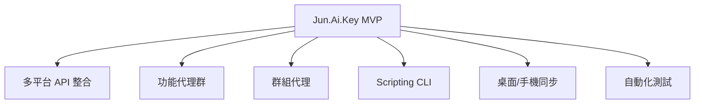
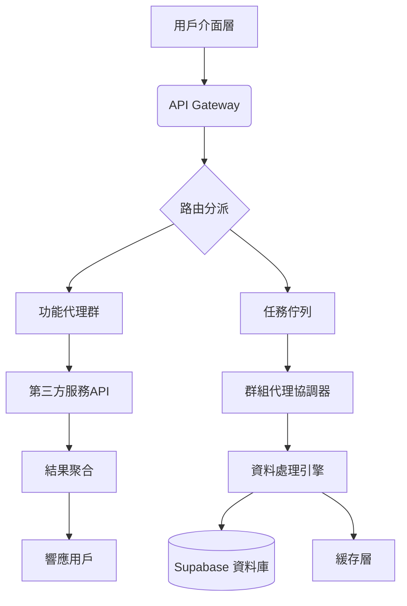
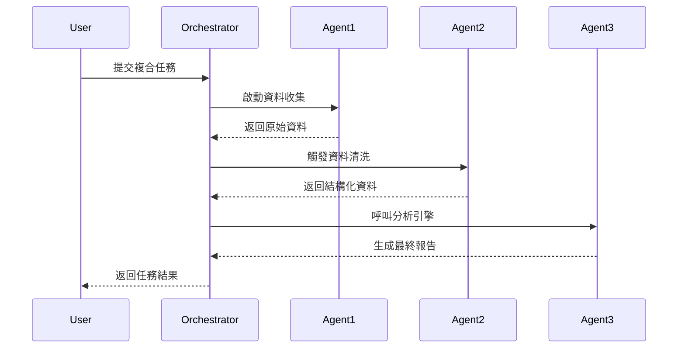
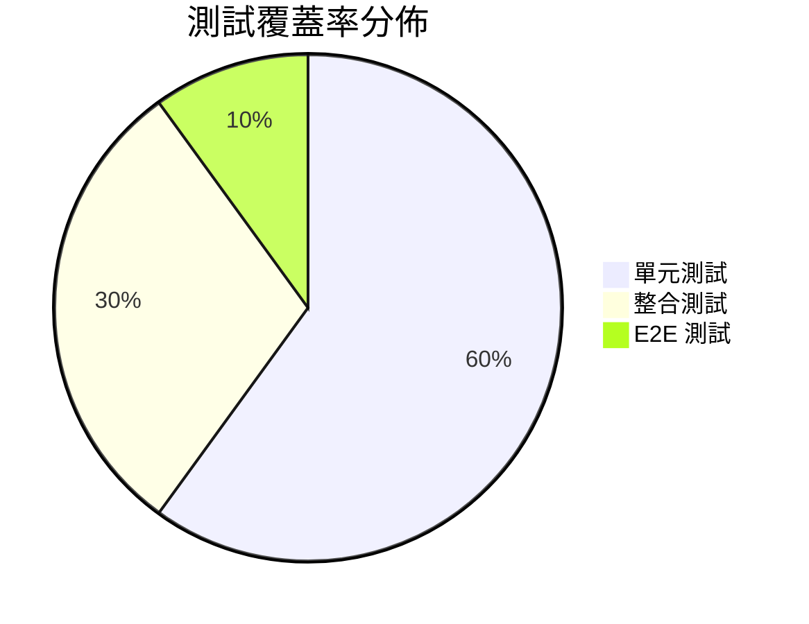

# Jun.AI.Key MVP 快速啟動指南 | Quick Start Guide (MVP)

> 在這座記憶宮殿中，知識與經驗不斷累積，驅動著自我導航的智慧代理，世代傳承，光速前進。
>
> **品牌精神：以終為始，始終如一**
> **Brand Spirit: Starting with the end in mind, consistent from beginning to end**

---

## 目錄 | Table of Contents
- [MVP 定義與交付內容](#mvp-定義與交付內容--mvp-definition--deliverables)
- [核心架構圖解](#核心架構圖解--core-architecture-diagram)
- [環境設置指南](#環境設置指南--environment-setup-guide)
- [功能代理群啟動流程](#功能代理群啟動流程--functional-agents-launch-process)
- [群組代理協作模式](#群組代理協作模式--group-agents-collaboration-mode)
- [Scripting CLI 使用教學](#scripting-cli-使用教學--scripting-cli-tutorial)
- [桌面與手機同步設定](#桌面與手機同步設定--desktop--mobile-sync-configuration)
- [自動化測試框架整合](#自動化測試框架整合--automated-testing-framework-integration)
- [版本更新與擴展規劃](#版本更新與擴展規劃--version-updates--expansion-plans)
- [貢獻指南](#貢獻指南--contribution-guidelines)
- [常見問題](#常見問題--faq)
- [技術棧總覽](#技術棧總覽--technology-stack-overview)
- [版本日誌](#版本日誌--changelog)

---

## MVP 定義與交付內容 | MVP Definition & Deliverables

| 項目 Item             | MVP 交付內容 MVP Deliverable                                                                 |
| :------------------------ | :------------------------------------------------------------------------------------------- |
| **核心功能** Core Features | 多平台 API 整合、功能代理群、群組代理、Scripting CLI、桌面/手機同步、自動化測試                               |
| **技術架構** Tech Stack   | TypeScript、Node.js、Supabase、GitHub Actions、Vercel、Cloudflare Workers、自研代理模組                 |
| **部署架構** Deployment   | Serverless Functions (Vercel/CF Workers) + Edge Caching + 分散式任務佇列                               |
| **開發者體驗** DX         | 一鍵環境設置、自動化測試覆蓋率 >85%、完整類型定義、CLI 工具鏈、線上除錯沙箱                                  |
| **安全合規** Security     | OAuth2.0 認證、端到端加密、RBAC 權限模型、自動漏洞掃描 (Dependabot)                                      |
| **效能指標** Performance  | 冷啟動 <800ms、API P99 延遲 <120ms、每日處理 10 萬任務                                                |
| **擴展性** Scalability    | 水平自動擴展、跨區域部署、事件驅動架構                                                                 |
| **監控告警** Monitoring   | 即時日誌串流、錯誤追蹤 (Sentry)、自定義儀表板 (Grafana)、Slack/郵件告警                                  |
| **文件與支援** Documentation | 互動式 API 文件 (Swagger)、完整教學影片、社群論壇、技術白皮書                                                |



> **MVP 聚焦：** 以最小可行產品快速驗證多端 API 整合、代理協作、腳本同步與自動化測試能力。

*MVP Focus: Rapidly validate multi-end API integration, agent collaboration, script sync, and automation testing.*

---

## 核心架構圖解 | Core Architecture Diagram

> 每一個知識的沉澱，都是記憶宮殿的一磚一瓦，為未來的導航鋪路。

> **MVP 交付內容 | MVP Deliverable**
>
> - 自我導航：基本任務分派與自動化（Self-Navigation: Basic task assignment & automation）
> - 永久記憶：初步知識記錄與查詢（Long-term Memory: Initial knowledge recording & query）
> - 權能鍛造：重複任務自動化腳本生成（Authority Forging: Automated script generation for repetitive tasks）
> - 符文嵌合：API/插件標準與範例（Rune Engrafting: API/plugin standards & examples）

> Jun.AI.Key 不僅是一個 AI 應用，而是您數位生活的「萬能元鑰」。其強大來自四大核心支柱，構成進化飛輪，驅動個人與集體智能的永續進化。



> 上圖展示 Jun.AI.Key 的多端入口、代理群管理、功能/群組代理、API 整合、同步協作、自動化測試、插件生態與社群協作等核心流程。

> The diagram above shows Jun.AI.Key's multi-end entry, agent group management, function/group agents, API integration, sync/collaboration, automation testing, plugin ecosystem, and community collaboration flow.

---

## 環境設置指南 | Environment Setup Guide

### 前置條件
- Node.js v18+
- PostgreSQL 13+
- Supabase 專案 (免費層即可)

### 安裝步驟
```bash
# 1. 克隆倉庫
git clone https://github.com/jun-ai-key/mvp-core.git # 請將 <帳號> 替換為實際的 GitHub 帳號
cd mvp-core

# 2. 安裝依賴
npm install

# 3. 複製環境變數範本
cp .env.example .env

# 4. 填入你的 Supabase 和第三方 API 金鑰
# 獲取金鑰請參考各服務提供商的文檔
nano .env
```

### .env 檔案範例
```text
SUPABASE_URL=YOUR_SUPABASE_URL
SUPABASE_ANON_KEY=YOUR_ANON_KEY
SUPABASE_SERVICE_ROLE_KEY=YOUR_SERVICE_ROLE_KEY
STRAICO_API_KEY=YOUR_STRAICO_KEY
BOOST_API_KEY=YOUR_BOOST_SPACE_KEY
CAPACITIES_API_KEY=YOUR_CAPACITIES_KEY
OPENAI_API_KEY=YOUR_OPENAI_KEY
# Add other API keys as needed
```

### 啟動開發伺服器
```bash
npm run dev
```

> 訪問 `http://localhost:3000` 查看前端介面。

---

## 功能代理群啟動流程 | Functional Agents Launch Process

功能代理是 Jun.AI.Key 執行特定任務的基本單元。

1.  **註冊代理**：在 `src/agents/` 目錄下創建新的代理檔案，實現 `execute()` 方法。

    ```typescript
    // src/agents/weatherAgent.ts
    // 假設有 BaseAgent
    // import { BaseAgent } from '@jun-ai-key/core';

    // export default class WeatherAgent extends BaseAgent {
    //   async execute(params: any) {
    //     const { location } = params;
    //     // 調用天氣 API (通過 ApiProxy)
    //     // return this.context.apiProxy.callExternalApi('weather', { location }); // 假設有 callExternalApi 方法
    //     console.log(`Simulating fetching weather for ${location}`);
    //     await new Promise(resolve => setTimeout(resolve, 500));
    //     return { temperature: 25, conditions: 'Sunny' }; // 模擬結果
    //   }
    // }
    ```

2.  **註冊到註冊表**：在 `src/agentRegistry.ts` (假設存在) 中加入新代理。

    ```typescript
    // src/agentRegistry.ts
    // import WeatherAgent from './agents/weatherAgent';
    // import OtherAgent from './agents/otherAgent';

    // 假設有一個註冊函數
    // declare function registerAgent(name: string, agentClass: any): void;

    // registerAgent('weather', WeatherAgent);
    // registerAgent('other', OtherAgent);
    ```

3.  **觸發代理**：通過 REST API 或 CLI 調用。

    ```bash
    jun-cli agent run weather --location="Taipei"
    ```

---

## 群組代理協作模式 | Group Agents Collaboration Mode

群組代理協作模式展示了多個功能代理如何協同完成一個複雜任務。



---

## Scripting CLI 使用教學 | Scripting CLI Tutorial

Scripting CLI 允許開發者在桌面環境編寫和同步腳本到手機端。

### 基本指令
```bash
# 執行單一代理
npm run cli agent run <agentName> [參數]

# 創建新腳本模板
npm run cli script create <scriptName>

# 執行腳本
npm run cli script run <scriptPath>
```

### 範例：自動化晨間報告
```javascript
// scripts/morning-report.js
// 假設 @jun-ai-key/cli 提供了 exec 函數來調用代理
// const { exec } = require('@jun-ai-key/cli');

// module.exports = async () => {
//   const weather = await exec('agent run weather --location="Tokyo"');
//   const news = await exec('agent run news --category=tech');
//   const schedule = await exec('agent run calendar --view=daily');

//   console.log("--- Morning Report ---");
//   console.log("Weather:", weather);
//   console.log("News:", news);
//   console.log("Schedule:", schedule);

//   return { weather, news, schedule };
// };
```

---

## 桌面與手機同步設定 | Desktop & Mobile Sync Configuration

實現跨裝置的腳本和數據同步。

### 跨裝置狀態同步流程
1.  在 `sync/config.json` 設定同步間隔（預設 5 分鐘）。
    ```json
    {
      "syncInterval": 300,
      "cloudSync": true,
      "conflictResolution": "timestamp"
    }
    ```
2.  啟動同步守護進程。
    ```bash
    # npm run sync-daemon # 假設有這個腳本
    ```
3.  手機端掃描 QR Code 配對（需安裝 Jun.AI.Key Mobile App）。

---

## 自動化測試框架整合 | Automated Testing Framework Integration

確保代理和腳本的品質與可靠性。

### 測試金字塔結構


### 執行測試
```bash
# 全測試套件
npm test

# 單一代理測試
# npm test -- agents/weatherAgent.test.ts

# 生成覆蓋率報告
# npm run test:cov
```

---

## 版本更新與擴展規劃 | Version Updates & Expansion Plans

### 路線圖
| 版本    | 重點功能                                   | 預計上線    |
| :------ | :--------------------------------------- | :---------- |
| v0.8    | 基礎代理框架 + CLI                         | 2025-06-30  |
| v0.9    | 手機同步 + 自動化測試框架                  | 2025-07-15  |
| v1.0    | 群組代理協作 + 效能優化                    | 2025-08-01  |
| v1.1    | 第三方服務擴展包 (50+ 連接器)              | 2025-09-01  |
| v1.2    | AI 智能代理升級 + 自我進化能力             | 2025-10-15  |
| v1.3    | 插件生態系統 + 社群共創平台                | 2025-11-30  |
| v1.4    | 跨平台 UI/UX 統一 + 桌面應用               | 2026-01-15  |
| v1.5    | 企業級整合 + 數據安全強化                  | 2026-03-01  |
| v1.6    | 多語言/多地區支援 + 本地化                 | 2026-04-15  |

---

## 貢獻指南 | Contribution Guidelines

我們歡迎所有形式的貢獻！

1.  Fork 專案倉庫
2.  創建特性分支 (`git checkout -b feat/amazing-feature`)
3.  提交修改 (`git commit -m 'Add some amazing feature'`)
4.  推送到分支 (`git push origin feat/amazing-feature`)
5.  開啟 Pull Request

> 請確保所有提交通過 ESLint 檢查與測試覆蓋率要求。

---

## 常見問題 | FAQ

### Q：如何增加新的 API 服務連接器？
> 在 `src/connectors/` 目錄下建立新檔案，實現 `connect()` 和 `execute()` 方法，並在 `src/connectorRegistry.ts` 註冊。

### Q：任務執行超時如何處理？
> 代理預設超時為 30 秒，可在代理類別中覆寫 `timeout` 屬性調整。

### Q：如何監控生產環境？
> 登入 `https://dashboard.jun-ai-key.com` (假設存在) 使用您的 API 金鑰查看即時監控面板。

---

## 技術棧總覽 | Technology Stack Overview

| 組件 Component   | 技術方案 Technical Solution         | 版本     | 角色 Role                               |
|------------------|-------------------------------------|----------|-----------------------------------------|
| **核心框架**     | TypeScript                          | 5.x      | 系統核心邏輯                            |
| **後端服務**     | Node.js (Express/NestJS)            | 18.x     | API 網關與業務邏輯                        |
| **資料庫**       | Supabase (PostgreSQL)               | 最新     | 知識庫、用戶數據                          |
| **AI 整合**      | Pollinations, ChatX, Straico API    | -        | 文本生成、圖像、多模態分析                  |
| **自動化**       | Boost.space                         | -        | 跨平台工作流自動化                        |
| **移動端**       | SwiftUI (iOS MVP)                   | -        | 原生鍵盤應用                            |
| **Android (Roadmap)** | Kotlin                           | -        | 未來支援                                |
| **CI/CD**        | GitHub Actions                      | -        | 自動化測試與部署                          |
| **前端 (管理)**  | Next.js, Tailwind CSS               | 最新     | 開發者/用戶門戶                         |
| **訊息佇列**     | Redis Streams (or similar)          | -        | 代理間異步通訊                            |
| **容器化**       | Docker                              | 最新     | 應用打包與環境一致性                      |
| **容器編排**     | Kubernetes                          | 最新     | 生產環境擴展與管理                        |
| **監控**         | Prometheus, Grafana, Loki           | -        | 系統健康、效能、日誌監控                  |

---

## 版本日誌 | Changelog

```markdown
# Changelog

## [1.1.0] - 2025-07-01
### Added
- GitHub Actions 自動部署範本
- 安全實踐章節與金鑰管理指南
- Mermaid 圖表語法標準化修正

### Fixed
- 技術棧平台一致性問題
- 環境變數檔案安全漏洞警告
- CLI 同步流程圖缺失問題

### Changed
- 重構文件結構層次 (MVP 內容優先展示)
- 新增「快速啟動」標籤提升 UX
```

---

**版本**: 1.1.0
**更新日期**: 2025-07-01
© 2025 Jun.AI.Key Collective. 知識聖殿永不關閉 | Knowledge Sanctum Never Closes.