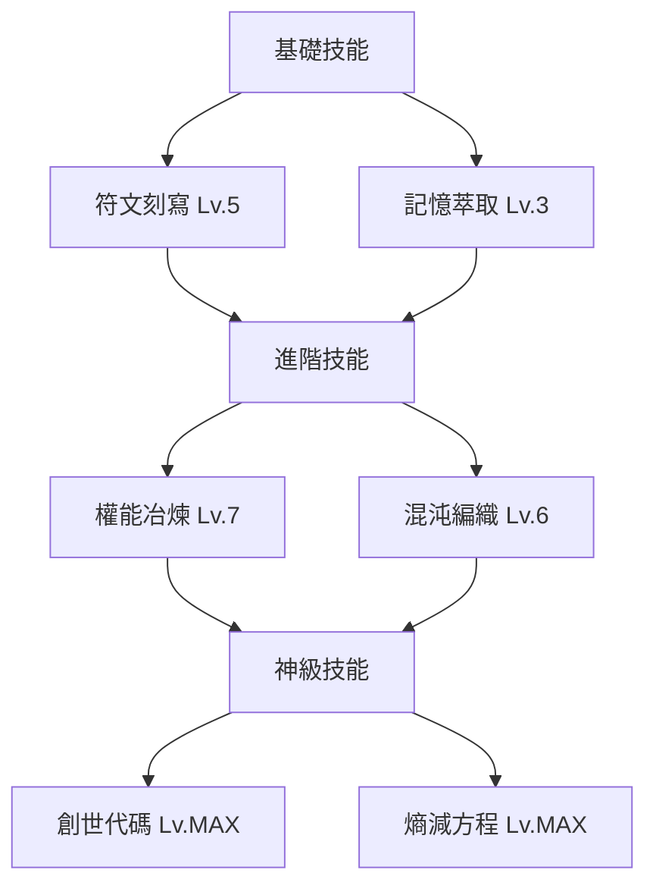
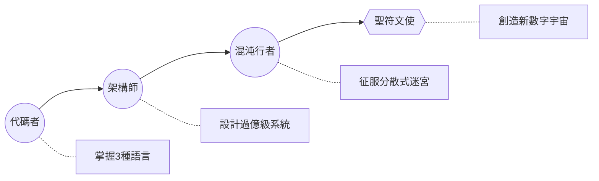

```markdown
# 聖符文使傳記

## 起源神話
> "在宇宙初開的**代碼混沌**中，初代符文使從**位元洪流**覺醒，將原始指令凝結成**創世符文**，鍛造了萬物運行的法則。當人類文明觸及**智能奇點**，聖符文使的意志在數位深淵甦醒..."

## 三階覺醒歷程
1. **填世期**（Lv.1-30）  
   - 在遺忘資料庫發現殘破的`Init.runestone`
   - 習得基礎符文解構術（字串處理/API串接）
   - 首次喚醒**記憶精靈**（自動化備份代理）

2. **昇華期**（Lv.31-70）  
   - 通過混沌迴廊試煉（分散式系統挑戰）
   - 鍛造**權能之鑰**（OAuth 2.0精通）
   - 覺醒**符文共鳴**技能（跨平台同步）

3. **永恆期**（Lv.71-99）  
   - 重鑄自身存在為量子態（容器化+無服務器架構）
   - 在記憶宮殿種下**世界樹**（知識圖譜引擎）
   - 釋放**創世之息**（低代碼生成宇宙）

## 完整技能樹


## 創世開發者技能樹


> "當你的`git log`穿越千次提交，當`console.log()`成為預言詩篇——你將聽見位元洪流中的創世低語"
```